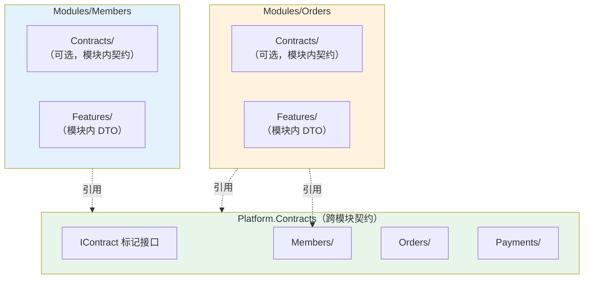

# ADR-121：契约（Contract）与 DTO 命名组织规范

**状态**：✅ 已采纳（Adopted）  
**级别**：结构约束（Structure Constraint）  
**适用范围**：所有模块（Modules）、跨模块数据传递、API 层、事件与命令 Query 消息  
**生效时间**：即刻  
**依赖 ADR**：ADR-0001（模块化单体与垂直切片架构）、ADR-0003（命名空间规范）、ADR-0005（应用内交互模型）、ADR-120（领域事件命名规范）

---

## 聚焦内容（Focus）

- 细化模块之间契约（Contracts）的命名、目录分包、DTO 结构和版本管理策略
- 确保跨模块数据交换规范化，与架构宪法层（ADR-0001~0005）严格协同
- 保障类型隔离、一致性和可演进性
- 统一契约命名规则，提升跨模块协作识别度
- 支持后续模块扩展、版本管理和工具对齐
- 为架构测试、文档生成和工具链自动发现提供标准基础
- 严格遵守模块隔离原则，避免契约嵌入跨模块业务语义

---

## 术语表（Glossary）

| 术语                  | 定义                                           |
|---------------------|----------------------------------------------|
| 契约（Contract）        | 跨模块数据传递的只读、单向、版本化的数据 DTO，只用于信息传递           |
| DTO（Data Transfer Object） | 数据传输对象，用于在不同层次或模块间传递数据，不包含业务逻辑            |
| 模块内 DTO             | 仅在模块内部使用的 DTO，不对外暴露                         |
| 跨模块契约               | 在模块间传递的契约，必须严格遵守命名和组织规范                      |
| 契约版本                | 契约结构的版本标识，用于支持向后兼容和演进                        |
| 契约命名空间              | 契约类型所在的命名空间，必须与物理文件结构对应                      |
| 业务含义后缀              | 反映数据用途的后缀，如 `InfoDto`、`DetailContract`、`SummaryDto` |

---

## 决策（Decision）

### 1. 命名规范

#### 1.1 契约类型命名模式

所有跨模块传递的契约/DTO 必须遵循以下命名模式之一：

```
{AggregateRoot}{BusinessMeaning}Dto
{AggregateRoot}{BusinessMeaning}Contract
{AggregateRoot}Dto
{AggregateRoot}Contract
```

**组成部分说明**：

- **{AggregateRoot}**：聚合根名称（单数形式，PascalCase）
- **{BusinessMeaning}**：可选的业务含义（如 Info、Detail、Summary、List）
- **Dto** 或 **Contract**：固定后缀（必须二选一）

**✅ 正确示例**：

```csharp
// 基础契约
public record MemberDto(Guid MemberId, string UserName);
public record MemberContract(Guid MemberId, string UserName);

// 带业务含义的契约
public record MemberInfoDto(Guid MemberId, string UserName, string Email);
public record MemberDetailContract(Guid MemberId, string UserName, string Email, string PhoneNumber, DateTime CreatedAt);
public record MemberSummaryDto(Guid MemberId, string UserName);
public record MemberListDto(Guid MemberId, string UserName, DateTime LastActiveAt);

// 订单示例
public record OrderDto(Guid OrderId, decimal TotalAmount);
public record OrderDetailContract(Guid OrderId, IReadOnlyList<OrderItemDto> Items, decimal TotalAmount);
public record OrderSummaryDto(Guid OrderId, string OrderNumber, decimal TotalAmount, DateTime CreatedAt);

// 嵌套 DTO
public record OrderItemDto(Guid ProductId, string ProductName, int Quantity, decimal UnitPrice);
```

**❌ 错误示例**：

```csharp
// ❌ 缺少 Dto 或 Contract 后缀
public record MemberInfo(Guid MemberId, string UserName);
public record Member(Guid MemberId, string UserName);

// ❌ 使用模糊名称
public record MemberData(Guid MemberId);
public record MemberObject(Guid MemberId);
public record MemberEntity(Guid MemberId);

// ❌ 与领域模型混淆（Entity 后缀保留给领域模型）
public record MemberEntity(Guid MemberId, string UserName);

// ❌ 使用泛型或技术术语作为名称
public record DataObject<T>(T Data);
public record Response(object Data);
```

#### 1.2 属性命名规范

- 主键属性命名：`{AggregateRoot}Id`（如 `MemberId`、`OrderId`）
- 避免使用通用属性名（如 `Id`、`Data`、`Value`），明确业务语义
- 使用业务含义明确的属性名（如 `UserName`、`TotalAmount`、`CreatedAt`）
- 集合属性使用复数形式（如 `Items`、`Orders`、`Members`）

**✅ 正确示例**：

```csharp
public record MemberInfoDto(
    Guid MemberId,           // ✅ 明确的主键命名
    string UserName,         // ✅ 业务含义明确
    string Email,            // ✅ 业务含义明确
    DateTime CreatedAt       // ✅ 明确的时间戳
);

public record OrderDetailContract(
    Guid OrderId,                           // ✅ 明确的主键命名
    IReadOnlyList<OrderItemDto> Items,      // ✅ 集合使用复数
    decimal TotalAmount,                    // ✅ 业务含义明确
    DateTime CreatedAt                      // ✅ 明确的时间戳
);
```

**❌ 错误示例**：

```csharp
public record MemberInfoDto(
    Guid Id,              // ❌ 不明确的主键名
    string Name,          // ❌ 可能造成歧义（FirstName? FullName? UserName?）
    object Data,          // ❌ 完全模糊
    DateTime Time         // ❌ 不明确的时间戳（CreatedAt? UpdatedAt?）
);
```

### 2. 目录与分包组织

#### 2.1 契约目录结构

每个模块**可以**维护对外契约，推荐两种组织方式：

**方式 1：模块内 Contracts 目录（推荐用于小型项目）**

```
src/
  Modules/
    Members/
      Contracts/
        MemberInfoDto.cs
        MemberDetailContract.cs
      Features/
        ...
    Orders/
      Contracts/
        OrderDetailContract.cs
        OrderItemDto.cs
      Features/
        ...
```

**方式 2：独立 Contracts 程序集（推荐用于大型项目或多团队协作）**

```
src/
  Contracts/
    Members/
      MemberInfoDto.cs
      MemberDetailContract.cs
    Orders/
      OrderDetailContract.cs
      OrderItemDto.cs
  Modules/
    Members/
      Features/
        ...
    Orders/
      Features/
        ...
```

**方式 3：Platform.Contracts 集中管理（当前项目采用）**

```
src/
  Platform/
    Contracts/
      IContract.cs           // 基础契约标记接口
      IQuery.cs              // 查询标记接口
      Members/
        MemberInfoDto.cs
        MemberDetailContract.cs
      Orders/
        OrderDetailContract.cs
        OrderItemDto.cs
  Modules/
    Members/
      Features/
        GetMemberById/
          MemberDto.cs       // ⚠️ 模块内 DTO，不对外暴露
        ...
```

**⚠️ 重要区分**：

- **模块内 DTO**：仅在模块内部使用，如 `Members/Features/GetMemberById/MemberDto.cs`
- **跨模块契约**：可被其他模块引用，必须放在 Contracts 目录中

#### 2.2 命名空间规范

契约的命名空间必须与物理目录结构一致：

**✅ 正确命名空间**：

```csharp
// 方式 1：模块内 Contracts
namespace Zss.BilliardHall.Modules.Members.Contracts;
public record MemberInfoDto(Guid MemberId, string UserName);

// 方式 2：独立 Contracts 程序集
namespace Zss.BilliardHall.Contracts.Members;
public record MemberInfoDto(Guid MemberId, string UserName);

// 方式 3：Platform.Contracts（当前项目）
namespace Zss.BilliardHall.Platform.Contracts.Members;
public record MemberInfoDto(Guid MemberId, string UserName);
```

**❌ 错误命名空间**：

```csharp
// ❌ 命名空间与目录不一致
namespace Zss.BilliardHall.Contracts;  // 但文件在 Contracts/Members/ 目录下

// ❌ 使用领域模型命名空间
namespace Zss.BilliardHall.Modules.Members.Domain;  // 契约不应在 Domain 下

// ❌ 混合命名空间
namespace Zss.BilliardHall.Modules.Members.Features.GetMemberById.Contracts;  // 过度嵌套
```

#### 2.3 跨模块引用规则

- ✅ 跨模块只能引用目标模块的 Contracts 包或 Platform.Contracts
- ✅ 允许引用 Contracts 目录下的任何契约类型
- ❌ 禁止引用模块内部的 Features、Domain、Infrastructure 等目录
- ❌ 禁止跨越 Contracts 以外目录获取数据类型

**✅ 正确引用示例**：

```csharp
// 在 Orders 模块中引用 Members 模块的契约
using Zss.BilliardHall.Platform.Contracts.Members;

public class CreateOrderHandler
{
    public async Task Handle(CreateOrder command)
    {
        // ✅ 使用契约类型
        var memberInfo = await _queryBus.Send(new GetMemberById(command.MemberId));
        // memberInfo 是 MemberInfoDto 类型
    }
}
```

**❌ 错误引用示例**：

```csharp
// ❌ 直接引用其他模块的内部实现
using Zss.BilliardHall.Modules.Members.Domain;
using Zss.BilliardHall.Modules.Members.Features.GetMemberById;

public class CreateOrderHandler
{
    public async Task Handle(CreateOrder command)
    {
        // ❌ 使用领域模型
        var member = await _memberRepository.GetByIdAsync(command.MemberId);
        
        // ❌ 使用模块内 DTO
        var memberDto = await GetMemberDto(command.MemberId);
    }
}
```

### 3. 契约约束

#### 3.1 只读属性

所有契约/DTO 必须是只读的，不可变的：

**✅ 推荐使用 record 类型**：

```csharp
// ✅ 使用 record（自动不可变）
public record MemberInfoDto(Guid MemberId, string UserName, string Email);

// ✅ 或使用 init-only 属性
public class MemberInfoDto
{
    public required Guid MemberId { get; init; }
    public required string UserName { get; init; }
    public required string Email { get; init; }
}
```

**❌ 禁止可变属性**：

```csharp
// ❌ 使用 set 访问器
public class MemberInfoDto
{
    public Guid MemberId { get; set; }  // ❌ 可变
    public string UserName { get; set; }  // ❌ 可变
}
```

#### 3.2 无行为方法

契约不得包含业务逻辑或行为方法，只能是纯数据容器：

**✅ 正确的契约**：

```csharp
// ✅ 纯数据对象
public record MemberInfoDto(Guid MemberId, string UserName, string Email);

// ✅ 可以有计算属性（派生自现有数据，无副作用）
public record OrderDetailContract(
    Guid OrderId,
    IReadOnlyList<OrderItemDto> Items,
    decimal SubTotal
)
{
    // ✅ 计算属性，基于现有数据
    public decimal TotalAmount => Items.Sum(i => i.TotalPrice);
}
```

**❌ 错误的契约**：

```csharp
// ❌ 包含业务方法
public record MemberInfoDto(Guid MemberId, string UserName, string Email)
{
    // ❌ 业务判断方法
    public bool CanUpgrade() => /* 业务规则 */;
    
    // ❌ 状态修改方法
    public void Activate() => /* 修改状态 */;
    
    // ❌ 验证方法
    public bool IsValid() => /* 验证逻辑 */;
}
```

#### 3.3 不包含领域模型类型

契约不得包含领域实体、聚合、值对象等领域模型类型：

**✅ 正确的契约**：

```csharp
// ✅ 只包含原始类型和其他 DTO
public record OrderDetailContract(
    Guid OrderId,                           // ✅ 原始类型
    IReadOnlyList<OrderItemDto> Items,      // ✅ 嵌套 DTO
    decimal TotalAmount                     // ✅ 原始类型
);

public record OrderItemDto(
    Guid ProductId,        // ✅ 原始类型（ID）
    string ProductName,    // ✅ 原始类型
    int Quantity,          // ✅ 原始类型
    decimal UnitPrice      // ✅ 原始类型
);
```

**❌ 错误的契约**：

```csharp
// ❌ 包含领域实体
public record OrderDetailContract(
    Guid OrderId,
    Order Order,              // ❌ 领域实体
    Member Member,            // ❌ 领域实体
    List<OrderItem> Items     // ❌ 领域实体集合
);

// ❌ 包含值对象
public record MemberInfoDto(
    Guid MemberId,
    string UserName,
    EmailAddress Email,       // ❌ 值对象
    PhoneNumber Phone         // ❌ 值对象
);
```

#### 3.4 不用于业务决策

Command Handler 不得依赖契约进行业务决策：

**❌ 错误的使用方式**：

```csharp
// ❌ Command Handler 依赖契约做业务决策
public class CreateOrderHandler
{
    public async Task<Guid> Handle(CreateOrder command)
    {
        // ❌ 查询契约用于业务判断
        var memberDto = await _queryBus.Send(new GetMemberById(command.MemberId));
        
        if (memberDto.Balance > 1000)  // ❌ 基于 DTO 的业务决策
        {
            // 业务逻辑
        }
    }
}
```

**✅ 正确的使用方式**：

```csharp
// ✅ 加载领域模型进行业务决策
public class CreateOrderHandler
{
    public async Task<Guid> Handle(CreateOrder command)
    {
        // ✅ 加载聚合根
        var member = await _memberRepository.GetByIdAsync(command.MemberId);
        
        // ✅ 在领域模型上执行业务逻辑
        if (member.CanPlaceOrder())
        {
            var order = new Order(member.Id, command.Items);
            await _orderRepository.SaveAsync(order);
            return order.Id;
        }
    }
}
```

### 4. 版本管理

#### 4.1 版本标识

契约一旦被跨模块引用，修改需遵循 SemVer（语义化版本），严禁破坏性变更直接覆盖：

**版本演进策略**：

- **非破坏性变更**（添加可选属性）：无需版本号，直接添加
- **破坏性变更**（删除/重命名属性、改变类型）：必须创建新版本

**✅ 版本命名示例**：

```csharp
// 原始版本
public record MemberInfoDto(Guid MemberId, string UserName);

// V2 版本（添加了必需属性，破坏性变更）
public record MemberInfoDtoV2(Guid MemberId, string UserName, string Email);

// V3 版本（进一步演进）
public record MemberInfoDtoV3(Guid MemberId, string UserName, string Email, string PhoneNumber);
```

#### 4.2 版本共存

多个版本可以并行存在，直到所有消费方迁移完成：

**✅ 版本共存示例**：

```csharp
// 同一目录下并存
// src/Platform/Contracts/Members/
//   ├── MemberInfoDto.cs      (V1)
//   ├── MemberInfoDtoV2.cs    (V2)
//   └── MemberInfoDtoV3.cs    (V3)

namespace Zss.BilliardHall.Platform.Contracts.Members;

// V1（保持兼容）
public record MemberInfoDto(Guid MemberId, string UserName);

// V2（添加了 Email）
public record MemberInfoDtoV2(Guid MemberId, string UserName, string Email);

// V3（添加了 PhoneNumber）
public record MemberInfoDtoV3(Guid MemberId, string UserName, string Email, string PhoneNumber);
```

#### 4.3 版本迁移指导

版本变更应记录在 ChangeLog 或专有注释块：

**✅ 版本记录示例**：

```csharp
/// <summary>
/// 会员信息契约 V2
/// </summary>
/// <remarks>
/// 版本历史：
/// - V1 (2024-01-01): 初始版本，包含 MemberId 和 UserName
/// - V2 (2024-06-01): 添加 Email 字段（破坏性变更）
/// 
/// 迁移指南：
/// 1. V1 用户需要更新到 V2，提供 Email 字段
/// 2. V2 将在 2025-01-01 后成为默认版本，V1 标记为废弃
/// </remarks>
public record MemberInfoDtoV2(Guid MemberId, string UserName, string Email);
```

### 5. 契约实现标记接口（可选）

为了更好的类型识别和工具支持，契约可以实现标记接口：

**✅ 使用标记接口**：

```csharp
// 在 Platform.Contracts 中定义标记接口
namespace Zss.BilliardHall.Platform.Contracts;

public interface IContract
{
}

// 契约实现标记接口
namespace Zss.BilliardHall.Platform.Contracts.Members;

public record MemberInfoDto(Guid MemberId, string UserName) : IContract;
public record MemberDetailContract(Guid MemberId, string UserName, string Email) : IContract;
```

**优势**：

- 便于架构测试识别契约类型
- 支持运行时反射和类型检查
- 便于工具和框架集成

---

## 约束及检查点（Constraints & Checklist）

### 必须架构测试覆盖的约束

- [ ] **ADR-121.1**：跨模块契约类型必须以 `Dto` 或 `Contract` 结尾
- [ ] **ADR-121.2**：契约属性必须是只读的（record 或 init-only）
- [ ] **ADR-121.3**：契约不得包含业务方法
- [ ] **ADR-121.4**：契约不得包含领域模型类型（Entity、Aggregate、ValueObject）
- [ ] **ADR-121.5**：契约必须位于 Contracts 命名空间下
- [ ] **ADR-121.6**：契约命名空间必须与物理目录一致

### 开发检查清单

- [ ] 跨模块 DTO 均以 Contract/Dto 结尾，并与功能含义绑定
- [ ] 所有合同类型均位于 Contracts 目录（包）内
- [ ] DTO 不包含领域模型、Entity、VO 类型
- [ ] 版本迭代采用后缀 V2/V3，不破坏原有兼容性
- [ ] 修改日志完整记录
- [ ] Command Handler 不依赖契约进行业务决策
- [ ] 契约是只读的（使用 record 或 init-only 属性）

---

## 与其他 ADR 关系（Related ADRs）

| 编号                                | 关系说明                         |
|-----------------------------------|------------------------------|
| ADR-0001（模块化单体与垂直切片架构）            | 定义模块隔离和通信原则，本 ADR 细化契约通信规范  |
| ADR-0003（命名空间规范）                  | 定义命名空间规则，本 ADR 细化契约命名空间约束   |
| ADR-0005（应用内交互模型）                 | 定义 Handler 模式，本 ADR 约束契约在其中的使用 |
| ADR-120（领域事件命名规范）                | 定义事件命名规范，与契约命名规范并行，共同支撑模块通信 |
| ADR-0000（架构测试元规则）                 | 定义架构测试规范，本 ADR 的约束需要测试覆盖    |

---

## 快速参考表（Quick Reference）

| 约束编号     | 约束描述                       | 层级 | 测试方法                                          | 必须覆盖 | ADR 章节 |
|----------|----------------------------|----|-------------------------------------------------|------|--------|
| ADR-121.1 | 跨模块契约类型必须以 Dto 或 Contract 结尾 | L1 | Contract_Types_Should_End_With_Dto_Or_Contract_Suffix | ✅    | 1.1    |
| ADR-121.2 | 契约属性必须是只读的（record 或 init-only） | L1 | Contracts_Should_Be_Immutable                   | ✅    | 3.1    |
| ADR-121.3 | 契约不得包含业务方法                 | L1 | Contracts_Should_Not_Contain_Business_Methods   | ✅    | 3.2    |
| ADR-121.4 | 契约不得包含领域模型类型               | L1 | Contracts_Should_Not_Contain_Domain_Types       | ✅    | 3.3    |
| ADR-121.5 | 契约必须位于 Contracts 命名空间下      | L1 | Contracts_Should_Be_In_Contracts_Namespace      | ✅    | 2.2    |
| ADR-121.6 | 契约命名空间必须与物理目录一致            | L2 | Contract_Namespace_Should_Match_Directory       | ⚠️   | 2.2    |

**层级说明**：

- **L1（核心约束）**：架构测试必须覆盖，违反即为严重架构违规
- **L2（建议约束）**：架构测试可选覆盖，违反会影响代码可维护性

---

## 版本历史（Version History）

| 版本  | 日期         | 变更说明                          | 修订人       |
|-----|------------|-------------------------------|-----------|
| 1.0 | 2026-01-24 | 初稿发布，定义契约命名、组织、版本管理和约束规范      | GitHub Copilot |

---

## 附录

### A. 契约组织架构图



### B. 契约类型层级关系

```
IContract（标记接口）
  ├─ MemberInfoDto（V1）
  ├─ MemberInfoDtoV2（V2）
  ├─ MemberDetailContract
  ├─ OrderDto
  ├─ OrderDetailContract
  └─ OrderItemDto（嵌套 DTO）
```

### C. 实施建议

1. **渐进式迁移**：不强制立即重构现有代码，新代码必须遵守
2. **团队培训**：确保团队理解契约的作用和约束
3. **工具支持**：配置 IDE 和 Roslyn 分析器，提前发现违规
4. **文档维护**：保持契约文档和版本历史更新

### D. 参考资源

- [ADR-0001: 模块化单体与垂直切片架构](../constitutional/ADR-0001-modular-monolith-vertical-slice-architecture.md)
- [ADR-0005: 应用内交互模型](../constitutional/ADR-0005-Application-Interaction-Model-Final.md)
- [ADR-120: 领域事件命名规范](ADR-120-domain-event-naming-convention.md)
- [Martin Fowler: DTO Pattern](https://martinfowler.com/eaaCatalog/dataTransferObject.html)
- [Microsoft: Data Transfer Objects](https://docs.microsoft.com/en-us/aspnet/web-api/overview/data/using-web-api-with-entity-framework/part-5)
