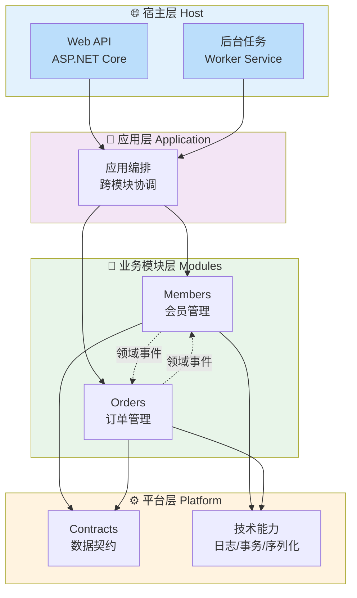
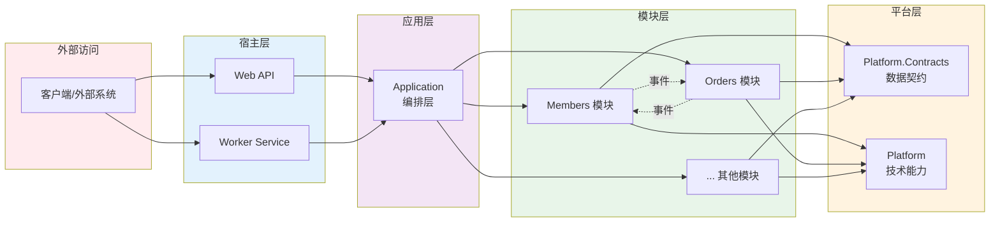
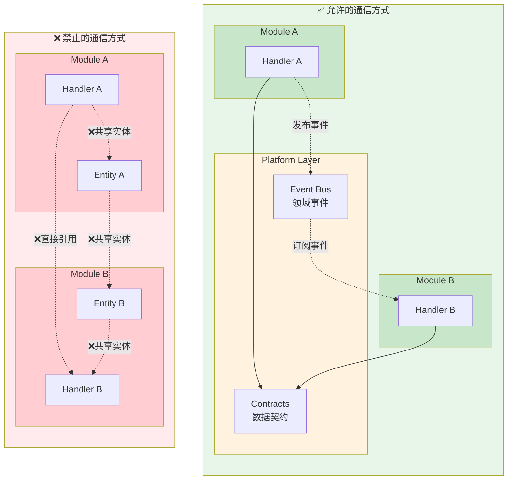
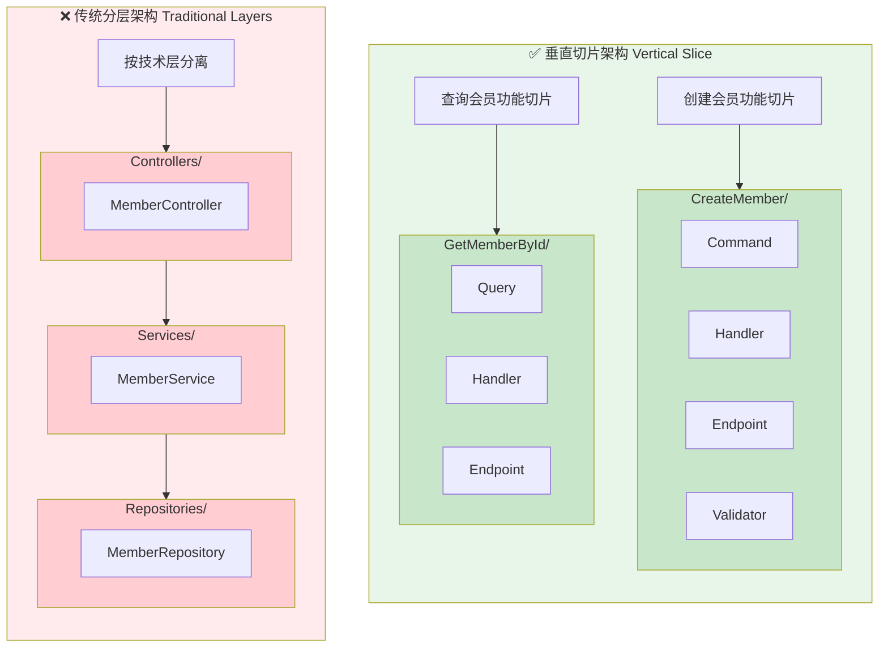
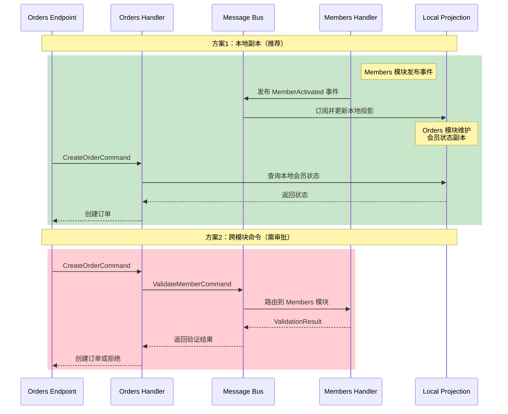
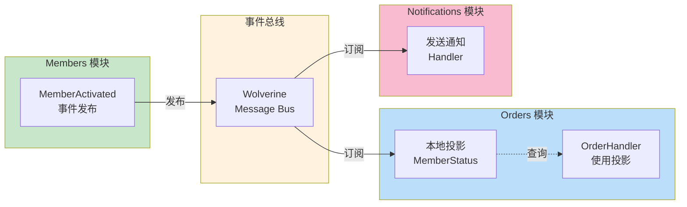

# 架构指南

> ⚠️ **无裁决力声明**：本文档仅供参考，不具备架构裁决权。
> 所有架构决策以相关 ADR 正文为准。详见 [ADR 目录](adr/README.md)。

## 概述

本项目采用 **模块化单体架构**（Modular Monolith）结合 **垂直切片架构**（Vertical Slice Architecture）。

核心原则：

1. **模块隔离** - 业务模块之间不能直接相互引用
2. **垂直切片** - 功能按用例组织，而非技术层
3. **架构测试** - 所有架构约束通过自动化测试强制执行

详细的自动化验证体系请参阅：[架构自动化验证系统](architecture-automation-verification.md)

## 架构决策记录 (ADR)

所有重要的架构决策都记录在 [ADR 文档](/docs/adr/) 中：

- [ADR-0001: 模块化单体与垂直切片架构决策](/docs/adr/constitutional/ADR-0001-modular-monolith-vertical-slice-architecture.md)

## 项目结构

### 🏗️ 架构层次可视化



### 📦 模块依赖关系



<details>
<summary>📝 文本格式目录树（点击展开）</summary>

> 💡 **提示**：文本格式便于复制粘贴使用，而上方的可视化图表更直观易懂。建议先通过图表理解结构，需要时再复制文本格式。

```
Zss.BilliardHall/
├── docs/                          # 文档
│   └── adr/                       # 架构决策记录
├── src/
│   ├── Platform/                  # 平台层（技术能力）
│   │   ├── Contracts/             # 数据契约
│   │   └── ...                    # 日志、事务、序列化等
│   ├── Modules/                   # 业务模块
│   │   ├── Members/               # 会员模块
│   │   │   ├── Features/          # 按功能组织
│   │   │   │   ├── CreateMember/  # 创建会员切片
│   │   │   │   └── GetMemberById/ # 查询会员切片
│   │   │   └── README.md
│   │   └── Orders/                # 订单模块
│   │       ├── Features/
│   │       └── README.md
│   ├── Application/               # 应用层（模块编排）
│   └── Host/                      # 宿主程序
│       ├── Web/Web.csproj         # Web API
│       └── Worker/Worker.csproj   # 后台任务
└── tests/
    └── ArchitectureTests/         # 架构约束测试
```

</details>

## 模块设计规则

### 1. 模块隔离规则

#### 🔒 模块通信规则可视化



**✅ 允许：**

- 模块可以依赖 `Platform`
- 模块可以通过领域事件通信
- 模块可以使用 `Platform.Contracts` 中定义的数据契约

**❌ 禁止：**

- 模块之间直接相互引用
- 共享聚合根、实体或值对象
- 跨模块调用 Handler

### 2. 垂直切片规则

每个功能切片（Feature）应该：

- 包含该用例的所有逻辑（端点、命令/查询、Handler、验证等）
- 自包含，不依赖横向的 Service
- 命名清晰，反映业务意图

#### 🎯 垂直切片架构对比



**目录结构示例：**

```
Features/
└── CreateMember/                      # 创建会员功能
    ├── CreateMemberCommand.cs         # 命令（表达意图）
    ├── CreateMemberCommandHandler.cs  # 处理器（业务逻辑）
    ├── CreateMemberEndpoint.cs        # API 端点
    └── CreateMemberValidator.cs       # 验证器（可选）
```

**❌ 禁止的组织方式：**

```
Members/
├── Application/       # 传统分层
├── Domain/
├── Infrastructure/
└── Services/          # 横向 Service
    └── MemberService.cs
```

### 3. 契约使用规则

数据契约（Contracts）定义在 `Platform.Contracts` 中，用于模块间数据传递。

**使用白名单：**

| 场景                   | 允许使用 | 说明               |
|----------------------|------|------------------|
| Command Handler      | ❌    | 禁止依赖其他模块的查询接口    |
| Query Handler        | ✅    | 可以返回契约           |
| Endpoint/API         | ✅    | 用于请求/响应          |
| ReadModel/Projection | ✅    | 视图模型             |
| Domain Events        | ✅    | 事件载荷             |
| Platform             | ❌    | Platform 不依赖业务契约 |

**示例：**

```csharp
// ❌ 错误：Command Handler 依赖其他模块的查询
public class CreateOrderCommandHandler
{
    private readonly IMemberQueries _memberQueries; // 违规！
}

// ✅ 正确：维护本地副本或发布验证命令
public class CreateOrderCommandHandler
{
    private readonly IDocumentSession _session;
    
    public async Task Handle(CreateOrderCommand command)
    {
        // 从本地副本查询（通过订阅事件保持同步）
        var memberStatus = await _session
            .Query<MemberStatusProjection>()
            .FirstOrDefaultAsync(m => m.MemberId == command.MemberId);
    }
}
```

### 4. Platform 层规则

Platform 层只能包含技术能力，不能包含业务逻辑。

**✅ 允许：**

- 日志、事务、序列化等技术组件
- 契约定义（IContract、IQuery）
- 基础设施抽象

**❌ 禁止：**

- 业务规则或判断
- 包含 `if (业务状态)` 的代码
- 依赖业务模块

## 开发指南

### 添加新功能

1. **确定功能所属模块**
   ```bash
   # 例如：添加"更新会员"功能到 Members 模块
   cd src/Modules/Members/Features
   mkdir UpdateMember
   ```

2. **创建切片文件**
   ```bash
   # 在 UpdateMember/ 目录下创建：
   - UpdateMemberCommand.cs
   - UpdateMemberCommandHandler.cs
   - UpdateMemberEndpoint.cs
   ```

3. **实现业务逻辑**
  - Command/Query: 只表达意图，不含逻辑
  - Handler: 包含所有业务规则和验证
  - Endpoint: 处理 HTTP 请求/响应

4. **避免横向抽象**
  - 不要创建 `MemberService`
  - 如需复用，优先考虑：
    1. 复制代码（切片独立性优先）
    2. 领域事件解耦
    3. 提取辅助方法（仅在必要时）

### 模块间通信

#### 📡 模块间通信方式对比



#### 🔄 事件驱动架构流程



**场景：Orders 模块需要验证会员状态**

**方案 1：维护本地副本（推荐）**

```csharp
// 1. 订阅 Members 模块的事件
public class MemberActivatedHandler
{
    public async Task Handle(MemberActivated @event)
    {
        // 更新 Orders 模块的本地投影
        await _session.Store(new MemberStatusProjection
        {
            MemberId = @event.MemberId,
            IsActive = true
        });
    }
}

// 2. 在 Handler 中使用本地副本
public class CreateOrderCommandHandler
{
    public async Task Handle(CreateOrderCommand command)
    {
        var memberStatus = await _session
            .Query<MemberStatusProjection>()
            .FirstOrDefaultAsync(m => m.MemberId == command.MemberId);
        
        if (memberStatus?.IsActive != true)
            throw new BusinessException("会员未激活");
    }
}
```

**方案 2：发布验证命令**

```csharp
public class CreateOrderCommandHandler
{
    private readonly IMessageBus _bus;
    
    public async Task Handle(CreateOrderCommand command)
    {
        // 发送命令到 Members 模块进行验证
        var result = await _bus.InvokeAsync<ValidationResult>(
            new ValidateMemberCommand(command.MemberId));
        
        if (!result.IsValid)
            throw new BusinessException(result.Message);
    }
}
```

## 架构测试

所有架构约束都通过自动化测试强制执行。

### 运行测试

```bash
# 构建项目
dotnet build

# 运行架构测试
dotnet test src/tests/ArchitectureTests/ArchitectureTests.csproj
```

### 测试套件

1. **ModuleIsolationTests** - 模块隔离测试
  - 模块不能相互引用
  - 禁止传统分层命名空间
  - 禁止 Repository/Service 命名

2. **ContractUsageTests** - 契约使用测试
  - Command Handler 不能依赖 IQuery 接口
  - Platform 不能依赖业务契约
  - Handler 命名约定

3. **VerticalSliceArchitectureTests** - 垂直切片测试
  - 禁止传统分层组织
  - Handler 不能依赖横向 Service
  - 禁止 Shared/Common 文件夹
  - Handler 之间不能直接调用

4. **PlatformLayerTests** - Platform 层测试
  - 不能包含业务相关命名
  - 只能包含技术能力
  - 不能引用业务模块
  - 契约应该是简单数据结构

### 处理架构违规

如果测试失败：

1. **理解违规原因** - 阅读测试失败信息
2. **修复代码** - 按照测试建议修改
3. **重新测试** - 确保修复有效
4. **如需豁免** - 必须：
  - 通过 ADR 记录原因
  - 在 PR 中标注 `ARCH-VIOLATION`
  - 设定偿还时间

## 常见问题

### Q: 为什么不能使用 Service 层？

A: 在垂直切片架构中，每个用例应该是自包含的。横向的 Service 会导致：

- 功能之间产生隐式依赖
- 业务逻辑分散
- 难以独立演进

如果多个切片有相似逻辑，优先考虑：

1. 复制代码（保持独立性）
2. 使用领域事件解耦
3. 提取辅助方法（谨慎使用）

### Q: 什么时候应该提取到 Platform？

A: 只有满足以下条件时才应该提取到 Platform：

- 纯技术能力（日志、序列化等）
- 没有业务语义
- 可被所有模块复用

如果包含业务判断，应该留在模块内。

### Q: 如何处理跨模块的数据查询？

A: 三种方式：

1. **本地副本** - 通过订阅事件维护（推荐）
2. **查询契约** - 定义在 Platform.Contracts，但只用于只读查询
3. **命令编排** - 在 Application 层编排多个模块的命令

### Q: DRY（Don't Repeat Yourself）怎么办？

A: 在垂直切片架构中，**模块独立性优先于代码复用**。适度的代码重复是可以接受的，因为：

- 切片之间保持独立
- 可以独立演进
- 不会因为"共享"而产生耦合

只在真正需要时才抽象。

## 参考资料

- [ADR-0001: 模块化单体与垂直切片架构决策](/docs/adr/constitutional/ADR-0001-modular-monolith-vertical-slice-architecture.md)
- [ADR-0002: Platform / Application / Host 三层启动体系](/docs/adr/constitutional/ADR-0002-platform-application-host-bootstrap.md)
- [ADR-0003: 命名空间与项目边界规范](/docs/adr/constitutional/ADR-0003-namespace-rules.md)
- [ADR-0004: 中央包管理规范](/docs/adr/constitutional/ADR-0004-Cpm-Final.md)
- [ADR-0005:应用内交互模型与执行边界](/docs/adr/constitutional/ADR-0005-Application-Interaction-Model-Final.md)
- [Vertical Slice Architecture - Jimmy Bogard](https://www.jimmybogard.com/vertical-slice-architecture/)
- [Modular Monolith - Kamil Grzybek](https://www.kamilgrzybek.com/blog/posts/modular-monolith-primer)
- [Architecture Tests README](/src/tests/ArchitectureTests/README.md)
