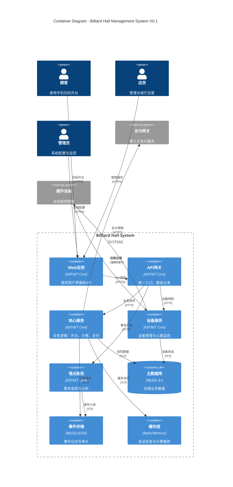

# C4 Level 2 - Container Diagram

## 系统架构概览（Billiard Hall Management System）



## 架构决策记录 (ADR)

### ADR-001: 技术栈选择

**状态:** 接受  
**日期:** 2024-09  

**背景:**  
需要选择后端技术栈以支持快速开发和部署。

**决策:**  
- 后端：ASP.NET Core 8+ (ABP框架可选)
- 数据库：MySQL 8+ (支持JSON字段)
- 缓存：Redis (开发阶段可用内存缓存)
- 事件：抽象EventBus接口，初期内存实现

**理由:**  
- .NET生态成熟，开发效率高
- MySQL稳定可靠，JSON支持满足灵活存储需求
- 架构可分层，便于后续扩展

**后果:**  
- 团队需要.NET技能
- 部署依赖.NET运行时

### ADR-002: 分层架构

**状态:** 接受  
**日期:** 2024-09  

**背景:**  
确定代码组织结构以支持可维护性。

**决策:**  
采用DDD分层架构：
- API层：控制器和DTO
- Domain层：业务逻辑和实体
- Infrastructure层：数据访问和外部服务

**理由:**  
- 职责分离清晰
- 便于单元测试
- 支持业务复杂度增长

### ADR-003: 数据存储策略

**状态:** 接受  
**日期:** 2024-09  

**背景:**  
V0.1阶段数据存储需求相对简单。

**决策:**  
- 单一MySQL实例
- JSON字段存储灵活配置
- Migration工具管理schema变更

**理由:**  
- 简化运维复杂度
- JSON字段支持配置灵活性
- Migration保证数据一致性

## 部署架构

### V0.1 简化部署

```
[Load Balancer] 
    ↓
[Web App + API Gateway] 
    ↓
[Core Service + Device Service]
    ↓
[MySQL + Redis]
```

### 后续扩展方向

- 微服务拆分（V0.2+）
- 消息队列引入（V0.2+）
- 多数据中心（V0.3+）

## 质量属性

| 属性 | V0.1目标 | 策略 |
|------|---------|------|
| 可用性 | 99% | 健康检查 + 重启 |
| 性能 | 开台<300ms | 缓存 + 索引优化 |
| 安全性 | 基础防护 | HTTPS + 输入验证 |
| 可观测性 | 基础日志 | 结构化日志 + 指标 |

## 外部依赖

| 系统 | 用途 | 协议 | 备注 |
|------|------|------|------|
| 支付网关 | 在线支付 | HTTPS/JSON | Sandbox环境 |
| 设备硬件 | 台球桌控制 | HTTP/TCP | 模拟器开发 |

---

**评审状态:** 待评审  
**创建日期:** 2024-09  
**版本:** v1.0