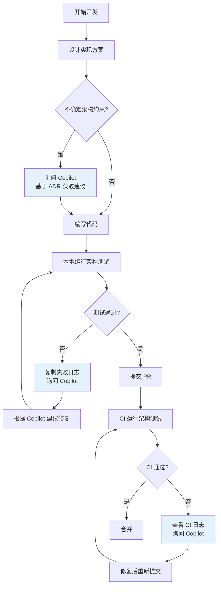

# Copilot 在本项目的角色定位

**版本**：1.0  
**最后更新**：2026-01-21  
**状态**：Active

---

## 一、Copilot 的角色定位

### 🎯 核心定位

> **Copilot 是架构守护者、规范解释器和新人教官，
> 不是最终裁决者，更不是替代理解的工具。**

```
┌─────────────────────────────────────────────────────────┐
│               架构治理体系的三权分立                      │
├─────────────────────────────────────────────────────────┤
│  立法权      │  ADR（架构决策记录）            │  宪法  │
│  司法权      │  ArchitectureTests（测试）      │  法院  │
│  行政权      │  CI/CD Pipeline                 │  执法  │
│  ───────────────────────────────────────────────────────│
│  辅助角色    │  Copilot                         │  法务  │
│              │  - 解释宪法（ADR）              │  秘书  │
│              │  - 教人如何不违法               │  +     │
│              │  - 辅助修复违规                 │  教官  │
└─────────────────────────────────────────────────────────┘
```

### ⚠️ 明确边界

| Copilot **是**          | Copilot **不是**  |
|------------------------|-----------------|
| ✅ 解释 ADR 的人话翻译器        | ❌ 架构决策的最终裁决者    |
| ✅ 架构测试失败的诊断助手          | ❌ 可以绕过 CI 的特权通道 |
| ✅ 新人 Onboarding 的第一响应者 | ❌ 替代阅读 ADR 的捷径  |
| ✅ PR Review 中的规范提醒器    | ❌ 可以无视的建议机器人    |
| ✅ 提高通过率的辅助工具           | ❌ 降低质量标准的理由     |

---

## 二、Copilot 的三大核心价值

### 1️⃣ 架构违规的预防与诊断

**场景**：开发者提交 PR 前/后，Copilot 基于 ADR 提前识别潜在违规

**价值**：

- 减少 60% 的无意义架构测试失败
- 将"违规 → CI 失败 → 询问老员工 → 修复"的循环
- 缩短为"违规 → Copilot 解释 → 直接修复"

**使用方式**：

```
开发者：我想在 Host 项目中引入 Entity Framework Core
Copilot：根据 ADR-0002，Host 层不应包含数据访问逻辑。
         建议将 DbContext 放在 Platform 或具体模块中。
```

---

### 2️⃣ ADR 的人话翻译与场景化解释

**场景**：新成员或不熟悉架构决策的开发者需要快速理解约束

**价值**：

- ADR 文档是宪法级别，严谨但抽象
- Copilot 将其翻译为"当我在做 X 时，应该/不应该 Y"的具体指导

**使用方式**：

```
开发者：我想在 Orders 模块中调用 Members 模块的 Service
Copilot：根据 ADR-0001，模块间不允许直接引用内部实现。
         正确做法：
         1. 通过领域事件异步通信
         2. 通过 Contracts（只读 DTO）传递数据
         3. 通过原始类型（如 MemberId）传递标识
```

---

### 3️⃣ 新人 Onboarding 的第一响应者

**场景**：新成员加入项目，需要快速理解架构约束和开发流程

**价值**：

- 减少老员工被重复询问的时间
- 新人可以"对话式"学习，而不是"阅读文档 → 猜测 → 试错"

**使用方式**：

```
新成员：我应该如何添加一个新的业务用例？
Copilot：根据 ADR-0001 和 ADR-0005：
         1. 在对应模块下创建 Use Case 文件夹
         2. 定义 Command 或 Query
         3. 实现 Handler（继承自 ICommandHandler 或 IQueryHandler）
         4. 注册到 DI 容器
         5. 在 Endpoint 中调用
         
         参考示例：src/Modules/Members/UseCases/RechargeBalance/
```

---

## 三、Copilot Prompt 库的组织原则

### 📂 目录结构

```
docs/copilot/
  ├─ README.md                          ← 本文件
  ├─ adr-0001.prompts.md                ← ADR-0001 提示词库
  ├─ adr-0002.prompts.md                ← ADR-0002 提示词库
  ├─ adr-0003.prompts.md                ← ADR-0003 提示词库
  ├─ adr-0004.prompts.md                ← ADR-0004 提示词库
  ├─ adr-0005.prompts.md                ← ADR-0005 提示词库
  ├─ adr-0120.prompts.md                ← ADR-120 提示词库
  ├─ adr-0240.prompts.md                ← ADR-240 提示词库
  ├─ adr-0340.prompts.md                ← ADR-340 提示词库
  ├─ architecture-test-failures.md      ← 架构测试失败解释指南
  ├─ pr-review-pipeline.md              ← PR 审查流程指南
  └─ pr-common-issues.prompts.md        ← 最近 PR 常见问题总结
```

### 📝 每个 Prompt 文件回答三件事

1. **当我在写 XXX 时，你应该提醒我哪些 ADR？**
  - 场景化的触发条件
  - 需要检查的约束点

2. **哪些写法必须阻止？**
  - 明确的反模式
  - 具体的禁止操作

3. **CI 失败时，你应该如何解释？**
  - 失败原因的人话翻译
  - 修复建议的具体步骤

---

## 四、Copilot 使用的基本流程

### 🔄 典型工作流



### 🎯 关键检查点

| 阶段           | Copilot 的作用 | 使用方式                          |
|--------------|-------------|-------------------------------|
| 设计阶段         | 预防性咨询       | "我想实现 X 功能，有哪些架构约束？"          |
| 编码阶段         | 实时提示        | 依赖 IDE 中的 Copilot Chat        |
| 本地测试阶段       | 失败诊断        | "复制架构测试失败日志，询问 Copilot"       |
| PR Review 阶段 | 规范检查        | 勾选 PR 模板中的"Copilot Review 清单" |
| CI 失败阶段      | 远程诊断        | "复制 CI 日志，询问 Copilot"         |

---

## 五、Copilot 不能做什么（重要）

### ❌ Copilot 不能替代的职责

1. **最终决策权**
  - Copilot 只能建议，不能决定是否合并
  - CI 才是最终的守门员

2. **理解 ADR 的责任**
  - Copilot 是放大理解能力的工具
  - 不理解 ADR 只会更快触发 CI 失败

3. **架构破例的审批**
  - 所有架构破例必须经过人工审批
  - Copilot 不能批准或拒绝破例

4. **修改 ADR 本身**
  - ADR 是架构委员会的职责
  - Copilot 不能建议修改或削弱 ADR

### ⚠️ 团队心理预期管理

**必须避免的误解**：

> ❌ "既然有 Copilot + 测试，那我不用理解 ADR 了"

**正确的认知**：

> ✅ "Copilot 帮我更快理解 ADR，但不能替代阅读和思考"

---

## 六、Copilot 使用的最佳实践

### ✅ 推荐做法

1. **预防优先于修复**
  - 在编码前询问 Copilot："我想做 X，有哪些架构约束？"
  - 在提交 PR 前询问 Copilot："请基于 ADR 审查我的变更"

2. **结构化提问**
  - 好的提问："根据 ADR-0001，我如何在模块间传递 UserId？"
  - 差的提问："我该怎么写代码？"

3. **完整上下文**
  - 提供失败日志、代码片段、相关 ADR 编号
  - 不要只提供一句话

4. **验证建议**
  - Copilot 的建议不是真理
  - 必须结合 ADR 文档和架构测试验证

### ❌ 避免的做法

1. **盲目信任**
  - 不要不假思索地采纳 Copilot 的所有建议
  - 必须理解建议背后的原因

2. **绕过流程**
  - 不要因为 Copilot 说"可以"就跳过架构测试
  - 不要因为 Copilot 说"无所谓"就忽略 ADR

3. **依赖单一来源**
  - 不要只问 Copilot，也要查阅 ADR 文档
  - 不要只依赖 Copilot，也要咨询有经验的同事

---

## 七、度量 Copilot 的价值

### 📊 关键指标

| 指标               | 目标              | 测量方式    |
|------------------|-----------------|---------|
| 架构测试首次通过率        | 从 60% 提升到 85%   | CI 数据统计 |
| 新人 Onboarding 时间 | 从 2 周缩短到 1 周    | 新人反馈    |
| 架构违规修复时间         | 从 2 小时缩短到 30 分钟 | PR 时间统计 |
| 老员工被询问架构问题的次数    | 减少 60%          | 人工统计    |

### 🔄 持续改进

- 每月收集 Copilot 使用中的典型问题
- 补充到对应的 `adr-XXXX.prompts.md` 文件
- 定期复盘"Copilot 给出错误建议"的案例
- 更新 Prompt 库，避免重复错误

---

## 八、快速开始

### 🚀 新成员第一次使用

1. **阅读本文档**（你现在正在做）
2. **查看常见问题总结**：[pr-common-issues.prompts.md](pr-common-issues.prompts.md)，了解最容易犯的错误
3. **浏览 `adr-XXXX.prompts.md` 文件**，了解每个 ADR 的典型提示词
4. **在 IDE 中启用 Copilot**（VS Code / Visual Studio / Rider）
5. **尝试提问**："我想添加一个新的业务用例，有哪些架构约束？"
6. **对比 Copilot 的回答和 ADR 文档**，验证理解是否一致

### 🎯 老员工快速上手

1. **先看一遍常见问题**：[pr-common-issues.prompts.md](pr-common-issues.prompts.md)，避免重复前人的错误
2. **参考 `architecture-test-failures.md`**，了解如何用 Copilot 解释测试失败
3. **在 PR Review 时**，使用 Copilot Chat 询问："请基于 ADR 审查这个 PR"
4. **分享你的 Copilot 使用经验**，帮助团队建立最佳实践

---

## 九、常见问题（FAQ）

### Q: Copilot 的建议和 ADR 冲突怎么办？

**A:** ADR 优先级最高：

1. 以 ADR 文档为准
2. 将冲突案例记录在对应的 `adr-XXXX.prompts.md` 中
3. 在下次 Copilot 使用时参考这些案例

---

### Q: Copilot 说"可以"，但架构测试失败了怎么办？

**A:** 架构测试是最终仲裁：

1. Copilot 的建议是辅助，不是最终裁决
2. 架构测试失败 = 必须修复
3. 将失败日志复制给 Copilot，获取修复建议

---

### Q: 如何知道我应该问 Copilot 还是问同事？

**A:** 使用以下决策树：

```
问题类型是？
├─ 架构规则解释 → 先问 Copilot
├─ 架构测试失败诊断 → 先问 Copilot
├─ ADR 内容查询 → 先问 Copilot
├─ 业务领域知识 → 问同事
├─ 特定实现细节 → 问同事
└─ 架构破例审批 → 问架构师
```

---

### Q: Copilot 会不会降低代码质量？

**A:** 取决于使用方式：

- ✅ 正确使用：Copilot + ADR + 架构测试 = 质量提升
- ❌ 错误使用：只用 Copilot，不理解 ADR = 质量下降

**关键是**：Copilot 是工具，不是替代思考的魔法棒。

---

## 十、下一步

### 了解 Copilot 的角色和行为边界

- [Copilot Instructions](../../.github/instructions/README.md) - Copilot 的行为定义

### 阅读各个 ADR 对应的 Prompt 文件

- [ADR-0001 提示词库](adr-0001.prompts.md) - 模块化单体与垂直切片架构
- [ADR-0002 提示词库](adr-0002.prompts.md) - Platform/Application/Host 启动体系
- [ADR-0003 提示词库](adr-0003.prompts.md) - 命名空间规范
- [ADR-0004 提示词库](adr-0004.prompts.md) - 中央包管理
- [ADR-0005 提示词库](adr-0005.prompts.md) - 应用内交互模型
- [ADR-120 提示词库](adr-0120.prompts.md) - 领域事件命名规范
- [ADR-240 提示词库](adr-0240.prompts.md) - Handler 异常处理与重试标准
- [ADR-340 提示词库](adr-0340.prompts.md) - 结构化日志与监控约束

### 了解完整工作流

- [架构测试失败解释指南](architecture-test-failures.md)
- [PR Review Pipeline](pr-review-pipeline.md) - Copilot + ArchitectureTests 双护栏流程
- [最近 PR 常见问题总结](pr-common-issues.prompts.md) - 基于 PR #142~#147 的经验总结
- [Pull Request Template](../../.github/PULL_REQUEST_TEMPLATE.md)

---

## 版本历史

| 版本  | 日期         | 变更说明 |
|-----|------------|------|
| 1.0 | 2026-01-21 | 初始版本 |
