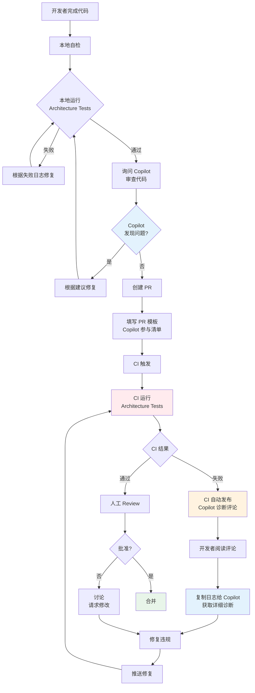

# Copilot Review + ArchitectureTests PR 流水线规范

**版本**：1.0  
**最后更新**：2026-01-21  
**状态**：Active

---

## 概述

本文档定义 "Copilot Review + ArchitectureTests" 双护栏机制的完整流程，确保所有 PR 在合并前经过：
1. **Copilot 辅助性审查** - 预防性识别潜在违规
2. **ArchitectureTests 强制验证** - 不可绕过的硬护栏

---

## 核心原则

```
┌─────────────────────────────────────────────────┐
│           双护栏机制                            │
├─────────────────────────────────────────────────┤
│  预防层    │  Copilot Review     │  辅助性    │
│  ────────────────────────────────────────────── │
│  强制层    │  ArchitectureTests  │  决定性    │
└─────────────────────────────────────────────────┘
```

### 明确职责分工

| 组件 | 职责 | 权限 | 失败后果 |
|------|------|------|---------|
| **Copilot Review** | 识别潜在问题、提供修复建议 | 建议权 | 提醒，不阻断 |
| **ArchitectureTests** | 验证 ADR 合规性 | 否决权 | 阻断合并 |

**关键**：
- ✅ Copilot 说"有问题" → 必须仔细审查
- ⚠️ Copilot 说"没问题" → 仍需通过 ArchitectureTests
- ❌ ArchitectureTests 失败 → **必须修复，无例外**

---

## 完整流程图



---

## 阶段一：本地开发

### 1.1 编码前咨询（推荐）

**场景**：不确定架构约束时

**操作**：
```
询问 Copilot：
"我想在 Orders 模块中 [具体操作]，有哪些架构约束需要注意？"
```

**Copilot 会参考**：
- `.github/instructions/backend.instructions.md`
- `docs/copilot/adr-XXXX.prompts.md`
- 相关 ADR 文档

**预期输出**：
- 适用的 ADR 列表
- 允许和禁止的模式
- 代码示例

---

### 1.2 本地架构测试（必须）

**操作**：
```bash
# 运行所有架构测试
dotnet test src/tests/ArchitectureTests/

# 运行特定 ADR 测试
dotnet test --filter "FullyQualifiedName~ADR_0001"
```

**如果失败**：

#### 步骤 1：复制完整失败日志

包括：
- 测试名称
- 失败消息
- 预期/实际结果

#### 步骤 2：询问 Copilot

```
询问 Copilot：
"请根据以下架构测试失败日志，解释违规原因并提供修复建议：

[粘贴完整失败日志]
"
```

**Copilot 会参考**：
- `docs/copilot/architecture-test-failures.md`
- 对应的 `docs/copilot/adr-XXXX.prompts.md`
- ADR 文档

**预期输出**：
- 违规分析（人话解释）
- 违反的具体 ADR 条款
- 逐步修复建议
- 正确实现示例

#### 步骤 3：根据建议修复

#### 步骤 4：重新运行测试验证

---

### 1.3 Copilot 预审查（推荐）

**操作**：
```
询问 Copilot：
"请基于 ADR-0001 至 ADR-0005 审查我的以下变更：

[粘贴代码或描述变更]
"
```

**Copilot 会参考**：
- `.github/instructions/architecture-review.instructions.md`
- 所有 `docs/copilot/adr-XXXX.prompts.md`

**预期输出**：
```markdown
## Architecture Review Summary

### ✅ Compliant Aspects
- 使用垂直切片组织 Use Case
- Handler 职责清晰

### ⚠️ Potential Concerns
- Command Handler 返回了 DTO，可能违反 ADR-0005
- 建议：只返回 ID，用单独的 Query 获取数据

### ❌ Violations Detected
- 无

### 📚 Recommended Reading
- docs/copilot/adr-0005.prompts.md (场景 2)
```

---

## 阶段二：提交 PR

### 2.1 填写 PR 模板

**必须完成的部分**：

#### Copilot 参与检查清单

```markdown
## 🤖 Copilot 参与检查清单

- [x] 已使用 Copilot 审查本 PR 的架构合规性
- [x] Copilot 未发现架构违规问题（或已按建议修复）
- [x] 如果 Copilot 提出建议，已评估并采纳合理建议

### Copilot Review 记录

询问："请基于 ADR-0001 至 ADR-0005 审查本 PR"

Copilot 回复摘要：
- ✅ 模块隔离符合 ADR-0001
- ✅ Handler 模式符合 ADR-0005
- ⚠️ 建议为复杂业务逻辑添加单元测试

已采纳建议：添加了 OrderTests.cs
```

#### 架构测试状态

```markdown
### 架构测试状态

- [x] 本 PR 通过了所有架构测试（`dotnet test src/tests/ArchitectureTests`）
- [ ] 本 PR 引入了架构破例（需要下方详细说明）
```

**如果勾选"架构破例"**：
- 必须填写完整的破例详情
- 必须获得架构师批准
- PR 标题必须加 `[ARCH-VIOLATION]` 前缀

---

### 2.2 PR 描述建议

**好的 PR 描述模板**：

```markdown
## 变更描述

添加订单创建功能，使用垂直切片架构。

## 架构相关

### 涉及的 ADR
- ADR-0001：新增 Orders 模块，遵循垂直切片
- ADR-0005：实现 CreateOrderHandler 和 CreateOrderQuery

### Copilot Review 要点
- ✅ 模块隔离：Orders 模块独立，不依赖其他业务模块
- ✅ CQRS：Command 返回 ID，Query 返回 DTO
- ✅ Endpoint：只负责 HTTP 映射

### 本地验证
```bash
$ dotnet test src/tests/ArchitectureTests/
✅ 所有测试通过 (36 passed, 0 failed)
```
```

---

## 阶段三：CI 验证

### 3.1 CI 触发

PR 创建/更新后，CI 自动运行：
```yaml
- name: Run architecture tests
  run: dotnet test src/tests/ArchitectureTests/
```

### 3.2 CI 成功

**CI 输出**：
```
✅ Architecture Compliance Summary

🎉 所有架构测试通过！

✅ 本 PR 符合以下架构决策记录（ADR）：
   - ADR-0001: 模块化单体与垂直切片架构
   - ADR-0002: Platform / Application / Host 三层启动体系
   - ADR-0003: 命名空间与项目边界规范
   - ADR-0004: 中央包管理（CPM）规范
   - ADR-0005: 应用内交互模型与执行边界

💡 提示：在 PR 中勾选 'Copilot 参与检查清单'
```

**下一步**：等待人工 Review

---

### 3.3 CI 失败

#### CI 输出（控制台）

```
❌ Architecture Tests Failed

⚠️ 架构测试失败检测到违规行为

📋 如何使用 Copilot 诊断和修复：

1️⃣ 查看详细的测试失败日志（在上方 'Run architecture tests' 步骤中）

2️⃣ 将失败日志复制给 GitHub Copilot，并询问：
   "请根据以下架构测试失败日志，解释违规原因并提供修复建议"

3️⃣ Copilot 会参考以下资源提供解释：
   - docs/copilot/README.md - Copilot 角色定位
   - docs/copilot/adr-XXXX.prompts.md - 各 ADR 的提示词库
   - docs/copilot/architecture-test-failures.md - 失败解释指南

4️⃣ 根据 Copilot 的建议修复代码

5️⃣ 本地验证修复：
   dotnet test src/tests/ArchitectureTests/

📚 相关资源：
   - Copilot 治理体系：https://github.com/.../docs/copilot/README.md
   - 架构测试失败指南：https://github.com/.../docs/copilot/architecture-test-failures.md
```

#### CI 自动评论（PR 中）

```markdown
## ❌ 架构测试失败

⚠️ 本 PR 的架构测试未通过，检测到架构违规行为。

### 📋 使用 Copilot 诊断和修复

#### 1️⃣ 查看失败日志
点击上方 "Run architecture tests" 步骤查看详细的失败信息。

#### 2️⃣ 询问 Copilot
将失败日志复制给 GitHub Copilot，并询问：

```
请根据以下架构测试失败日志，解释违规原因并提供修复建议

[粘贴失败日志]
```

#### 3️⃣ Copilot 参考资源
Copilot 会基于以下资源为你提供详细解释：
- [Copilot 治理体系](https://github.com/.../docs/copilot/README.md)
- [ADR 提示词库](https://github.com/.../docs/copilot)
- [架构测试失败解释指南](https://github.com/.../docs/copilot/architecture-test-failures.md)

#### 4️⃣ 修复并验证
根据 Copilot 的建议修复代码后，在本地运行：

```bash
dotnet test src/tests/ArchitectureTests/
```

### 📚 相关 ADR

- [ADR-0001: 模块化单体与垂直切片架构](...)
- [ADR-0002: Platform / Application / Host 三层启动体系](...)
- [ADR-0003: 命名空间与项目边界规范](...)
- [ADR-0004: 中央包管理（CPM）规范](...)
- [ADR-0005: 应用内交互模型与执行边界](...)

---

💡 **提示**：记得在 PR 描述中完成 "Copilot 参与检查清单"。
```

#### 开发者响应流程

1. **阅读 CI 输出和自动评论**

2. **复制失败日志**
   - 从 CI 步骤 "Run architecture tests" 中复制完整日志

3. **询问 Copilot**
   ```
   请根据以下架构测试失败日志，解释违规原因并提供修复建议：

   [粘贴失败日志]
   ```

4. **Copilot 提供诊断**
   ```markdown
   ### 违规分析

   **违反的 ADR**：ADR-0001
   **失败测试**：Modules_Should_Not_Reference_Other_Modules

   ### 问题描述

   Orders 模块直接引用了 Members 模块的内部实现（Domain 层）。

   ### 修复建议

   移除直接引用，使用以下合规方式之一：

   1. **领域事件**（推荐）：
   ```csharp
   await _eventBus.Publish(new OrderCreated(orderId, memberId));
   ```

   2. **数据契约**：
   ```csharp
   var memberDto = await _queryBus.Send(new GetMemberById(memberId));
   ```

   3. **原始类型**：
   ```csharp
   var command = new CreateOrder(memberId); // Guid, 不是 Member 对象
   ```
   ```

5. **根据建议修复代码**

6. **本地验证**
   ```bash
   dotnet test src/tests/ArchitectureTests/
   ```

7. **推送修复，触发 CI 重新运行**

---

## 阶段四：人工 Review

### 4.1 Reviewer 职责

即使 Copilot Review 和 ArchitectureTests 都通过，人工 Reviewer 仍需：

#### 必须检查

- [ ] PR 模板的 "Copilot 参与检查清单" 已完成
- [ ] 如果 Copilot 提出建议，是否有合理的采纳/不采纳说明
- [ ] 架构测试确实通过（检查 CI 结果）
- [ ] 代码变更与 PR 描述一致

#### 应该检查

- [ ] 业务逻辑是否合理
- [ ] 代码质量和可读性
- [ ] 测试覆盖是否充分
- [ ] 命名和注释是否清晰

#### 可以依赖 Copilot 的部分

- ✅ ADR 合规性（但仍应抽查）
- ✅ 常见架构反模式识别
- ✅ 模块边界检查

#### 不能依赖 Copilot 的部分

- ❌ 业务逻辑正确性
- ❌ 安全性判断
- ❌ 性能影响评估
- ❌ 最终合并决策

---

### 4.2 如果 Reviewer 发现问题

#### 场景 1：架构问题但测试通过

**可能原因**：
- 测试覆盖不完整（罕见）
- 测试本身有 bug（极罕见）
- 这是测试未覆盖的新场景

**处理**：
1. 在 PR 中明确指出问题
2. 引用相关 ADR
3. 建议开发者询问 Copilot
4. 如果是测试缺口，创建 Issue 跟踪

#### 场景 2：Copilot 未发现的问题

**可能原因**：
- 开发者未使用 Copilot Review
- Copilot 的判断范围有限
- 问题属于业务逻辑而非架构

**处理**：
1. 正常提出 Review 意见
2. 如果是常见问题，建议补充到 `docs/copilot/` 相关文件

---

## 阶段五：合并

### 5.1 合并前最终检查清单

自动化检查（CI 强制）：
- [x] 所有架构测试通过
- [x] 所有单元/集成测试通过
- [x] 构建成功

人工检查（Reviewer 负责）：
- [x] 至少一位 Reviewer 批准
- [x] Copilot 参与清单已完成
- [x] 所有 Review 意见已解决

### 5.2 合并

满足所有条件后，可以合并。

### 5.3 合并后

#### 如果发现遗漏的架构问题

1. **立即创建 Issue** 记录问题
2. **分析根因**：
   - 是测试缺口？→ 补充架构测试
   - 是 Copilot 提示不足？→ 更新 `docs/copilot/`
   - 是人工 Review 疏漏？→ 团队复盘
3. **修复问题**
4. **完善防护网**

---

## 特殊场景处理

### 场景 1：架构破例

**当必须违反 ADR 时**：

1. **PR 标题加前缀**：`[ARCH-VIOLATION] feat(Module): description`

2. **填写完整的破例说明**：
   ```markdown
   #### 违反的 ADR 规则
   - ADR-0001: 模块隔离

   #### 破例理由
   临时需要 Orders 模块同步查询 Members 数据以满足紧急业务需求。
   
   已评估的替代方案：
   1. 异步事件 - 无法满足实时性要求
   2. 数据复制 - 数据一致性风险高

   #### 归还计划
   计划在 Q2 重构为事件驱动架构。
   预计时间：2026-06-30
   负责人：@username
   ```

3. **获得架构师批准**

4. **记录在案**：破例会被记录在 `docs/summaries/governance/arch-violations.md`

---

### 场景 2：Copilot 误报

**如果 Copilot 错误地标记合规代码为违规**：

1. **记录案例**：
   - 在 PR 评论中说明
   - 引用相关 ADR 证明合规

2. **补充到 Prompt 库**：
   - 在相关的 `docs/copilot/adr-XXXX.prompts.md` 中添加澄清

3. **不要因此忽视 Copilot**：
   - 误报率低不代表可以跳过 Copilot Review
   - 持续完善 Prompt 库可以降低误报

---

### 场景 3：测试误报

**如果架构测试错误地失败**：

1. **验证是否真的误报**：
   - 仔细阅读 ADR
   - 询问 Copilot
   - 咨询架构师

2. **如果确认误报**：
   - 创建 Issue 报告测试 bug
   - 标题：`[ArchTest] 测试误报: TestName`
   - 提供详细场景说明

3. **临时处理**：
   - 获得架构师/Tech Lead 批准
   - 在 PR 中明确说明
   - 跟踪修复 Issue

---

## 度量与改进

### 关键指标

定期收集以下数据：

| 指标 | 目标 | 测量方式 |
|------|------|---------|
| 架构测试首次通过率 | >85% | CI 统计 |
| Copilot Review 使用率 | 100% | PR 模板勾选统计 |
| CI 失败后修复时间 | <30min | PR 时间戳分析 |
| 合并后发现的架构问题 | <1/月 | Issue 统计 |

### 持续改进

#### 每月回顾

1. **分析 CI 失败案例**
   - 哪些违规最常见？
   - 是否需要加强某个 ADR 的提示？

2. **收集 Copilot 使用反馈**
   - 哪些建议最有帮助？
   - 哪些地方 Copilot 判断不准确？

3. **更新 Prompt 库**
   - 补充新的场景和示例
   - 澄清误报案例

4. **完善架构测试**
   - 填补测试缺口
   - 修复测试 bug

---

## 常见问题（FAQ）

### Q1: 我必须使用 Copilot 吗？

**A:** PR 模板要求勾选 Copilot 参与清单，但更重要的是：
- ✅ 架构测试必须通过（强制）
- ✅ PR 必须经过人工 Review（强制）
- ⚠️ Copilot Review 是强烈建议，可以大幅提高通过率

### Q2: Copilot 说没问题，但 CI 失败了，怎么办？

**A:** 架构测试是最终裁决：
- Copilot 是辅助工具，不是权威
- 将 CI 失败日志复制给 Copilot，获取修复建议
- 修复代码直到测试通过

### Q3: CI 通过了，Reviewer 还需要检查架构吗？

**A:** 需要，但可以轻量化：
- ✅ 抽查关键变更是否合规
- ✅ 验证 Copilot 参与清单已完成
- ⏭️ 不需要逐行检查 ADR 合规性（CI 已验证）

### Q4: 如何处理紧急 hotfix？

**A:** 流程不变：
- 架构测试仍必须通过
- 可以简化人工 Review 流程
- 如果确需破例，走架构破例流程（不推荐）

---

## 总结

### 关键点

1. **双护栏机制**：Copilot（预防）+ ArchitectureTests（强制）
2. **职责明确**：Copilot 建议，测试决定
3. **自动化优先**：CI 失败自动提供 Copilot 诊断指引
4. **持续改进**：定期回顾，完善 Prompt 库和测试

### 成功标志

- ✅ 架构测试首次通过率 >85%
- ✅ 所有 PR 都完成 Copilot 参与清单
- ✅ CI 失败能在 30 分钟内修复
- ✅ 合并后很少发现架构问题

---

## 版本历史

| 版本 | 日期 | 变更说明 |
|------|------|----------|
| 1.0 | 2026-01-21 | 初始版本 |
