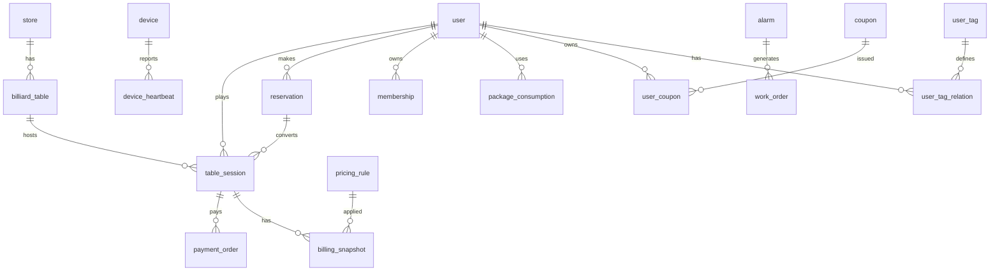

# 数据库概念模型（初稿）

> 目标：支持无人自助台球 MVP ~ V1.0 的核心交易、计费、设备、运营与营销功能。后续可根据实际技术栈（如 PostgreSQL / MySQL / 分库策略）再细化。命名风格：snake_case。

## 1. 总体设计原则

- 关键交易与计费数据保持强一致（使用事务 + 幂等键）。
- 写多读多场景（会话、心跳）可分离冷热：实时库 + 时序/日志存储（如 TSDB / Kafka 下游）。
- 采用逻辑删除字段 `is_deleted`（布尔）+ 创建/更新时间戳。
- 金额字段使用最小货币单位（分，int64）。
- 重要字段加唯一索引：如 session_no、payment_no、work_order_no。

> 相关流程与说明参见：[业务流程与状态机](flow-and-states.md) · [PRD](../prd/PRD.md) · [埋点追踪方案](../analytics/tracking-plan.md)

## 2. 核心实体概览

| 实体 | 说明 | 关键关系 |
|------|------|----------|
| store | 门店 | 1:N table, device, pricing_rule |
| table | 球台 | 1:N session, heartbeat |
| user | 用户 | 1:N session, payment, membership |
| session | 开台会话 | N:1 table / user；1:N payment |
| reservation | 预约 | 可转为 session |
| pricing_rule | 定价规则 | store 作用域 / 全局 |
| billing_snapshot | 计费快照 | 固化当次计算明细 |
| payment_order | 支付单 | 关联 session |
| settlement | 结算单 | 汇总多支付单（对账）|
| membership | 会员/套餐权益 | user 绑定 |
| package_consumption | 套餐抵扣流水 | 关联 session |
| coupon | 优惠券 | 规则模板 |
| user_coupon | 用户领取券 | 与 coupon 关联 |
| marketing_activity | 营销活动 | 驱动规则匹配 |
| device | 设备（灯控/摄像头） | 1:N heartbeat |
| device_heartbeat | 设备心跳 | 时序数据 |
| alarm | 告警事件 | 可生成工单 |
| work_order | 维护工单 | 生命周期跟踪 |
| user_tag / user_tag_relation | 用户标签 | 行为/画像 |
| event_log | 业务事件日志 | 供埋点与分析 |

## 3. 关键表字段建议

只列核心字段（省略通用字段：id, created_at, updated_at, is_deleted）。

### 3.1 store

| 字段 | 类型 | 说明 |
|------|------|------|
| name | varchar | 门店名称 |
| city | varchar | 城市 |
| status | tinyint | 1=正常 0=停用 |

### 3.2 table (billiard_table)

| 字段 | 类型 | 说明 |
|------|------|------|
| store_id | bigint | 关联门店 |
| code | varchar | 台编码（展示/扫码）|
| status | tinyint | 当前状态（枚举）|
| last_session_id | bigint | 最近会话 |

### 3.3 user

| 字段 | 类型 | 说明 |
|------|------|------|
| phone | varchar | 手机号（脱敏存储/唯一）|
| nickname | varchar | 昵称 |
| level | int | 会员等级 |
| source | varchar | 渠道来源 |

### 3.4 session (table_session)

| 字段 | 类型 | 说明 |
|------|------|------|
| session_no | varchar | 唯一业务编号 |
| table_id | bigint | 球台 |
| user_id | bigint | 发起用户 |
| start_time | datetime | 开始时间 |
| end_time | datetime | 结束时间（关闭后）|
| status | tinyint | 0=init 1=running 2=pending_close 3=closed 4=canceled |
| total_minutes | int | 总分钟（结束后）|
| billing_amount | bigint | 应付金额（分）|
| pay_status | tinyint | 0=unpaid 1=partial 2=paid |
| reservation_id | bigint | 来源预约（可空）|

### 3.5 reservation

| 字段 | 类型 | 说明 |
|------|------|------|
| reservation_no | varchar | 预约编号 |
| user_id | bigint | 用户 |
| table_id | bigint | 球台 |
| start_time | datetime | 预约开始 |
| end_time | datetime | 预约结束 |
| status | tinyint | 0=active 1=used 2=canceled 3=expired |

### 3.6 pricing_rule

| 字段 | 类型 | 说明 |
|------|------|------|
| store_id | bigint | 作用门店（null=全局）|
| name | varchar | 规则名称 |
| priority | int | 优先级（越小越高）|
| rule_type | tinyint | 1=分段 2=时段 3=节假日 4=活动占位 |
| config_json | text | JSON 存储动态参数 |
| active_from | datetime | 生效开始 |
| active_to | datetime | 生效结束 |
| status | tinyint | 1=启用 0=停用 |

### 3.7 billing_snapshot

| 字段 | 类型 | 说明 |
|------|------|------|
| session_id | bigint | 会话 |
| original_minutes | int | 原始时长 |
| rule_applied | json | 应用规则列表 |
| detail_breakdown | json | 分项明细 |
| final_amount | bigint | 最终金额（分）|

### 3.8 payment_order

| 字段 | 类型 | 说明 |
|------|------|------|
| payment_no | varchar | 支付单号 |
| session_id | bigint | 关联会话 |
| user_id | bigint | 支付人 |
| amount | bigint | 金额（分）|
| channel | varchar | wechat / alipay / balance |
| status | tinyint | 0=init 1=pending 2=success 3=fail 4=cancel 5=refunding 6=refunded |
| request_payload | json | 调起原始参数 |
| notify_payload | json | 回调内容 |

### 3.9 settlement

| 字段 | 类型 | 说明 |
|------|------|------|
| settle_no | varchar | 结算批次号 |
| date_range | varchar | 时间范围（如 2025-09-01~2025-09-07）|
| total_amount | bigint | 总金额 |
| success_count | int | 成功单数 |
| status | tinyint | 0=processing 1=done 2=failed |

### 3.10 membership

| 字段 | 类型 | 说明 |
|------|------|------|
| user_id | bigint | 用户 |
| level | int | 等级 |
| expire_at | datetime | 过期时间 |
| discount_rate | int | 折扣（如 90=9折）|

### 3.11 package_consumption

| 字段 | 类型 | 说明 |
|------|------|------|
| user_id | bigint | 用户 |
| package_id | bigint | 套餐 ID |
| session_id | bigint | 会话 |
| minutes_used | int | 使用分钟 |
| value_deducted | bigint | 抵扣货币价值（分）|

### 3.12 coupon / user_coupon

| coupon 字段 | 类型 | 说明 |
|------|------|------|
| coupon_no | varchar | 券模板编号 |
| name | varchar | 名称 |
| type | tinyint | 1=满减 2=直减 3=折扣 |
| config_json | json | 使用条件与金额参数 |
| total_issue | int | 发放总量 |
| issued_count | int | 已发放 |
| valid_from | datetime | 有效期开始 |
| valid_to | datetime | 有效期结束 |
| status | tinyint | 1=启用 |

| user_coupon 字段 | 类型 | 说明 |
|------|------|------|
| user_id | bigint | 用户 |
| coupon_id | bigint | 模板 |
| code | varchar | 用户券码 |
| status | tinyint | 0=未使用 1=锁定 2=已使用 3=过期 |
| lock_session_id | bigint | 锁定的会话（防并发）|
| used_at | datetime | 使用时间 |

### 3.13 marketing_activity

| 字段 | 类型 | 说明 |
|------|------|------|
| activity_no | varchar | 活动编号 |
| name | varchar | 活动名称 |
| type | tinyint | 1=首单 2=时段折扣 3=满减 4=拉新 |
| config_json | json | 规则参数 |
| active_from | datetime | 生效开始 |
| active_to | datetime | 生效结束 |
| status | tinyint | 1=启用 |

### 3.14 device / device_heartbeat

| device 字段 | 类型 | 说明 |
|------|------|------|
| store_id | bigint | 门店 |
| table_id | bigint | 球台（可空：网关类设备）|
| type | tinyint | 1=灯控 2=摄像头 3=网关 |
| sn | varchar | 序列号（唯一）|
| firmware_version | varchar | 固件版本 |
| status | tinyint | 1=正常 0=停用 2=异常 |

| device_heartbeat 字段 | 类型 | 说明 |
|------|------|------|
| device_id | bigint | 设备 |
| ts | datetime | 时间戳 |
| metrics_json | json | 电压/温度/信号等 |
| online | tinyint | 1=在线 0=离线预测 |

### 3.15 alarm

| 字段 | 类型 | 说明 |
|------|------|------|
| alarm_no | varchar | 告警编号 |
| source_type | tinyint | 1=设备 2=规则引擎 3=人工 |
| source_id | bigint | 关联 id |
| level | tinyint | 1=Low 2=Medium 3=High 4=Critical |
| category | varchar | offline / abuse / billing / security |
| message | varchar | 简述 |
| status | tinyint | 0=open 1=ack 2=closed |

### 3.16 work_order

| 字段 | 类型 | 说明 |
|------|------|------|
| work_order_no | varchar | 工单编号 |
| alarm_id | bigint | 来源告警 |
| assignee_id | bigint | 处理人 |
| status | tinyint | 0=open 1=processing 2=resolved 3=closed |
| priority | tinyint | 1=low 2=normal 3=high 4=urgent |
| description | text | 描述 |
| resolution | text | 解决记录 |
| sla_deadline | datetime | SLA 截止 |

### 3.17 user_tag / user_tag_relation

| user_tag 字段 | 类型 | 说明 |
|------|------|------|
| code | varchar | 标签编码 |
| name | varchar | 名称 |
| category | varchar | 行为 / 价值 / 生命周期 |

| user_tag_relation 字段 | 类型 | 说明 |
|------|------|------|
| user_id | bigint | 用户 |
| tag_id | bigint | 标签 |

### 3.18 event_log

| 字段 | 类型 | 说明 |
|------|------|------|
| event_type | varchar | 事件类型（SessionStarted 等）|
| biz_id | varchar | 业务ID（session/payment 等）|
| payload | json | 具体内容 |
| occurred_at | datetime | 发生时间 |

## 4. 关系示意 (Mermaid ER)

## 5. 分库/分表初步建议

- 日志/心跳/event_log：按月或按天分表（volume 大）。
- table_session / payment_order：可按 store_id 分库（未来规模再行拆分）。
- coupon/user_coupon：高频查询的用户券加缓存层（Redis key: user:{id}:coupons）。

## 6. 索引策略建议

- 唯一：session_no, payment_no, reservation_no, alarm_no, work_order_no, activity_no, sn。
- 组合：`payment_order(session_id,status)`，`table_session(table_id,status)`，`reservation(table_id,start_time)`。
- 时间序：`device_heartbeat(device_id, ts DESC)` 覆盖最近查询。

## 7. 审计与幂等

- 幂等键：开台 `session_token`，支付回调 `channel_txn_id`。
- 审计日志单独表（可后续补充 admin 操作记录）。

## 8. 待确认/开放问题

| 主题 | 问题 | 影响 |
|------|------|------|
| 套餐扣减模型 | 先抵扣分钟 vs 金额 | 影响计费解释性 |
| 动态定价 | 预计算缓存 vs 实时评估 | 性能与一致性 |
| 支付渠道扩展 | 聚合服务 or 嵌入式 | 开发复杂度 |
| 多币种 | 是否需要 | 国际化规划 |

---
> 下步：补充实际 DDL (`db/schema.sql`) 与迁移工具策略（Liquibase/Flyway）。
