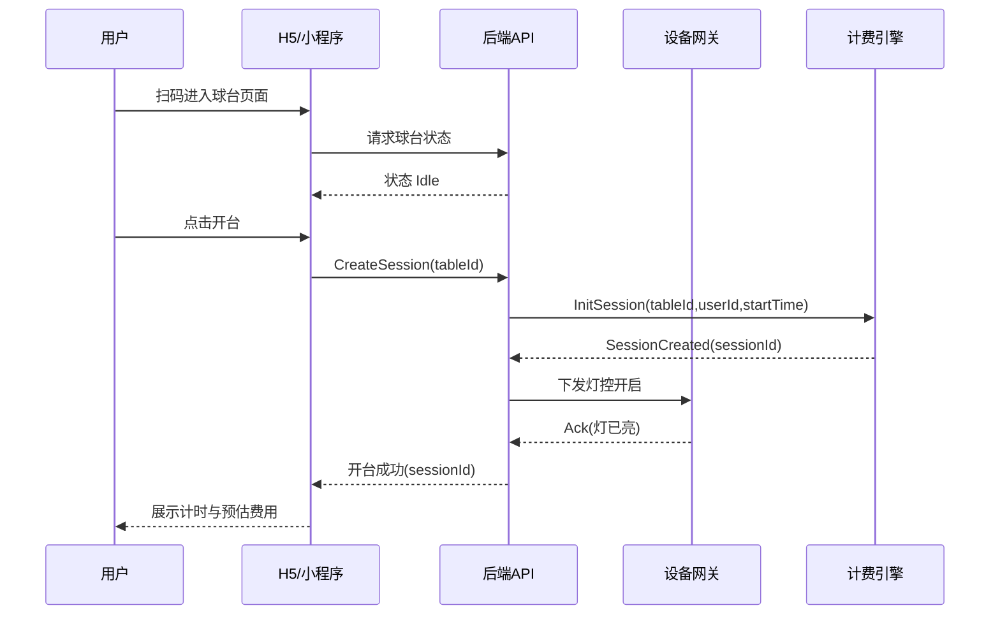
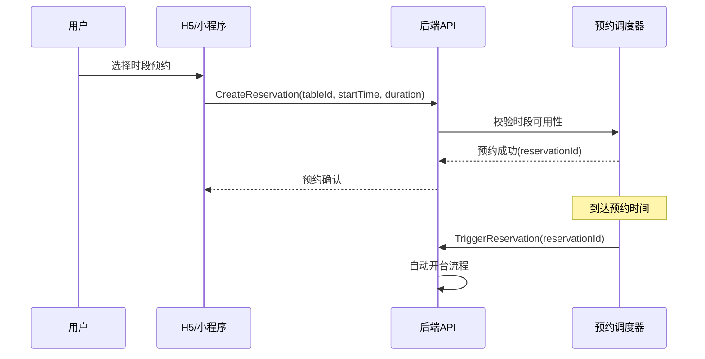
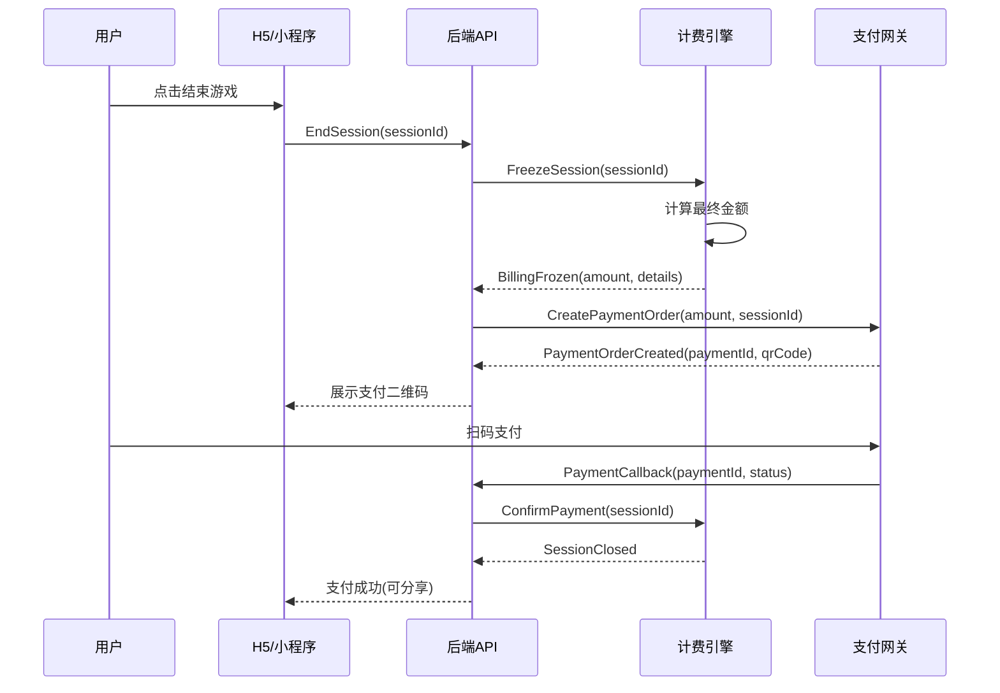
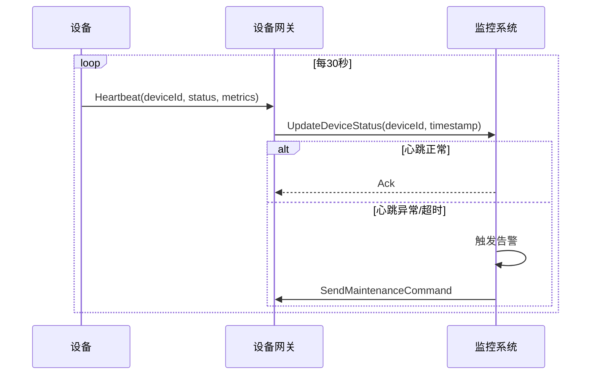

# 业务流程与状态机草稿

## 1. 核心业务流程概述

自助台球系统主要涉及：**开台** → **计费** → **关台** → **支付** 的核心链路，以及设备监控、会员管理等辅助流程。

---

## 2. 开台（即时）流程



### 2.1 状态变更

- **球台状态：** `Idle` → `InUse`
- **会话状态：** `创建` → `计时中`

### 2.2 异常处理

- 球台被占用：返回 409 冲突
- 设备离线：降级模式，记录告警
- 并发开台：乐观锁 + 重试

---

## 3. 预约开台流程



---

## 4. 关台与计费流程



### 4.1 状态变更

- **会话状态：** `计时中` → `计费冻结` → `已结算`
- **球台状态：** `InUse` → `Idle`

---

## 5. 核心状态机

### 5.1 球台状态机

```
[Idle] --开台--> [InUse] --结束--> [Billing] --支付完成--> [Idle]
                    |                   |
                    |--设备故障--> [Maintenance]
                    |
                [Reserved] --预约到期/取消--> [Idle]
```

**状态定义：**
- `Idle`: 空闲可用
- `Reserved`: 已预约
- `InUse`: 使用中
- `Billing`: 计费结算中
- `Maintenance`: 维护中

### 5.2 会话状态机

```
[Created] --开台成功--> [Active] --结束请求--> [Billing] --支付确认--> [Completed]
                           |                        |
                           |--超时--> [Timeout] --处理--> [Completed]
                           |
                        [Paused] --恢复--> [Active]
```

**状态定义：**
- `Created`: 会话已创建
- `Active`: 计时中
- `Paused`: 暂停（预留）
- `Billing`: 计费冻结
- `Timeout`: 超时未结束
- `Completed`: 已完成

### 5.3 支付状态机

```
[Created] --用户支付--> [Paying] --成功--> [Success]
                          |
                          |--失败--> [Failed] --重试--> [Paying]
                          |
                          |--超时--> [Expired]
```

---

## 6. 设备心跳与监控

### 6.1 心跳流程



### 6.2 设备状态定义

- `Online`: 在线正常
- `Offline`: 离线（>3 个心跳周期）
- `Warning`: 在线但指标异常
- `Maintenance`: 维护模式

---

## 7. 异常处理策略

### 7.1 网络异常

- **前端：** 重试 + 本地状态保持
- **后端：** 幂等设计 + 消息队列
- **设备：** 离线缓存 + 补发

### 7.2 支付异常

- **支付超时：** 自动查询订单状态
- **重复支付：** 幂等校验 + 退款处理
- **金额不一致：** 人工审核机制

### 7.3 设备故障

- **设备离线：** 自动切换到手动模式
- **灯控失效：** 降级 + 运维通知
- **传感器异常：** 数据修正 + 告警

---

## 8. 计费引擎详细设计

### 8.1 计费规则

```json
{
  "pricing_rules": {
    "base_rate": {
      "hourly_rate": 50.00,
      "minimum_charge": 30.00
    },
    "time_slots": [
      {
        "start": "09:00", "end": "18:00",
        "rate_multiplier": 1.0, "label": "平时"
      },
      {
        "start": "18:00", "end": "23:00", 
        "rate_multiplier": 1.5, "label": "高峰"
      }
    ],
    "member_discounts": [
      { "tier": "gold", "discount": 0.8 },
      { "tier": "silver", "discount": 0.9 }
    ]
  }
}
```

### 8.2 实时计费算法

```csharp
public class BillingEngine
{
    public BillingSnapshot CalculateCurrentBilling(Session session)
    {
        var duration = DateTime.Now - session.StartTime;
        var baseAmount = CalculateBaseAmount(duration);
        var adjustedAmount = ApplyDiscounts(baseAmount, session.UserId);
        
        return new BillingSnapshot
        {
            SessionId = session.Id,
            Duration = duration,
            BaseAmount = baseAmount,
            AdjustedAmount = adjustedAmount,
            LastUpdated = DateTime.Now
        };
    }
}
```

---

## 9. 关键时序事件（Event List）

| 事件 | 触发来源 | 主体 | 用途 | 下游消费示例 |
|------|----------|------|------|--------------| 
| TableHeartbeat | 设备网关 | 球台 | 在线监控 | 在线率统计、告警 |
| SessionStarted | 开台API | 台次会话 | 计费起点 | 计费引擎、增长埋点 |
| SessionEndedRequest | 用户操作 | 台次会话 | 进入冻结 | 支付流程 |
| BillingFrozen | 计费引擎 | 台次会话 | 产生金额 | 支付单生成 |
| PaymentCreated | 支付API | 支付单 | 渠道调起 | 风控、对账 |
| PaymentSucceeded | 支付回调 | 支付单 | 资金确认 | 结算、LTV 统计 |
| SessionClosed | 计费引擎 | 台次会话 | 会话归档 | 数据仓入仓 |
| AlarmRaised | 监控/检测 | 告警 | 运维响应 | 工单系统 |
| WorkOrderCreated | 系统/人工 | 工单 | 维护追踪 | KPI 统计 |

---

## 10. 数据一致性保证

### 10.1 分布式锁

```csharp
// 开台时防并发
public async Task<Session> StartSession(int tableId, int userId)
{
    var lockKey = $"table_start_{tableId}";
    using var distributedLock = await _lockProvider.AcquireAsync(lockKey);
    
    var table = await _repository.GetTable(tableId);
    if (table.Status != TableStatus.Idle)
        throw new BusinessException("球台不可用");
        
    // 原子操作：更新球台状态 + 创建会话
    using var transaction = _context.BeginTransaction();
    table.Status = TableStatus.InUse;
    var session = new Session(tableId, userId);
    await _repository.SaveChanges();
    await transaction.CommitAsync();
    
    return session;
}
```

### 10.2 补偿机制

- **支付成功但会话未关闭：** 定时任务补偿
- **会话结束但支付未创建：** 重新发起支付流程
- **设备状态不一致：** 优先以心跳状态为准

---

## 11. 相关文档导航

- [实施路线图](../implementation-roadmap.md)
- [埋点追踪方案](../analytics/tracking-plan.md)
- [数据库设计](../../doc/05_数据库设计/)
- [API 文档](../../doc/07_API文档/)

---

*最后更新: 2024-01*