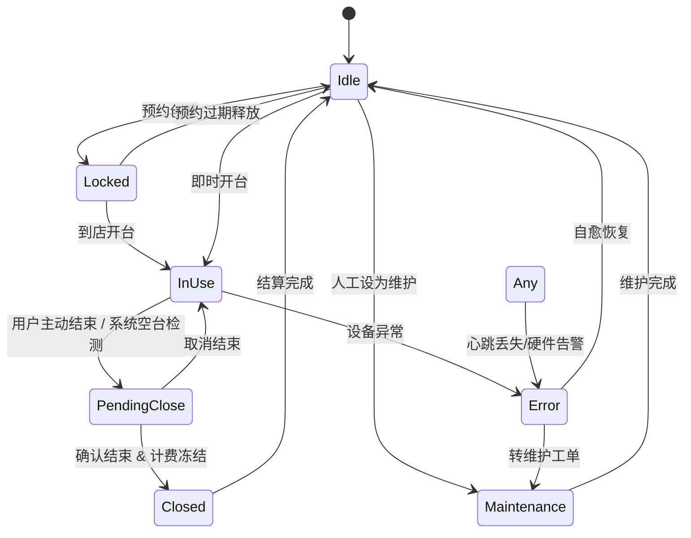
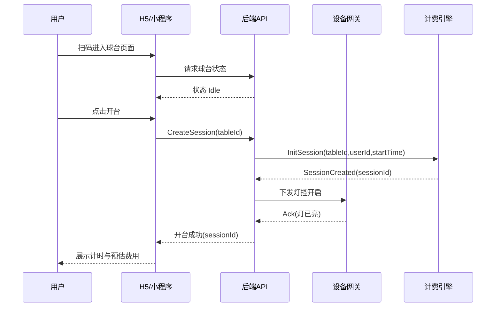
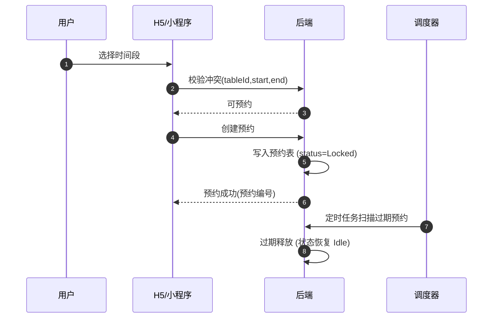
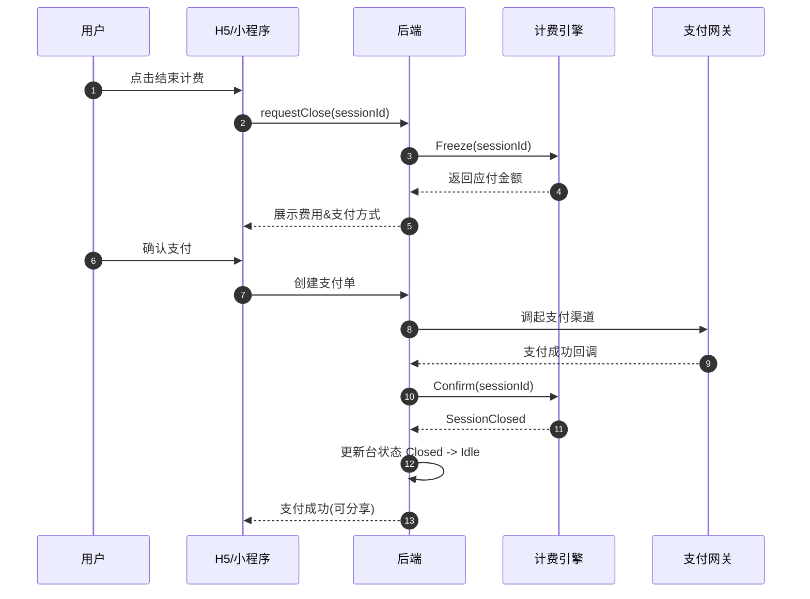
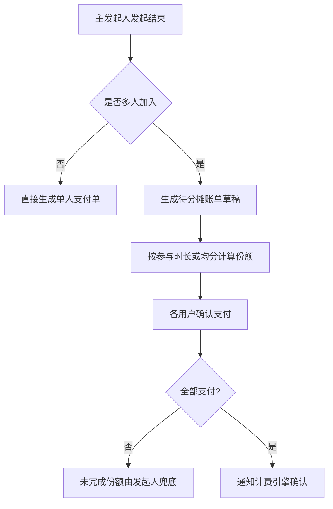
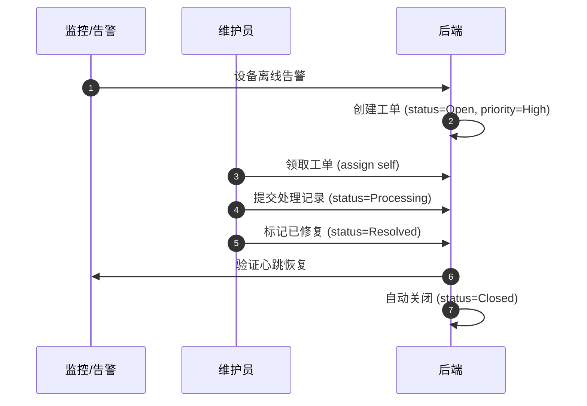
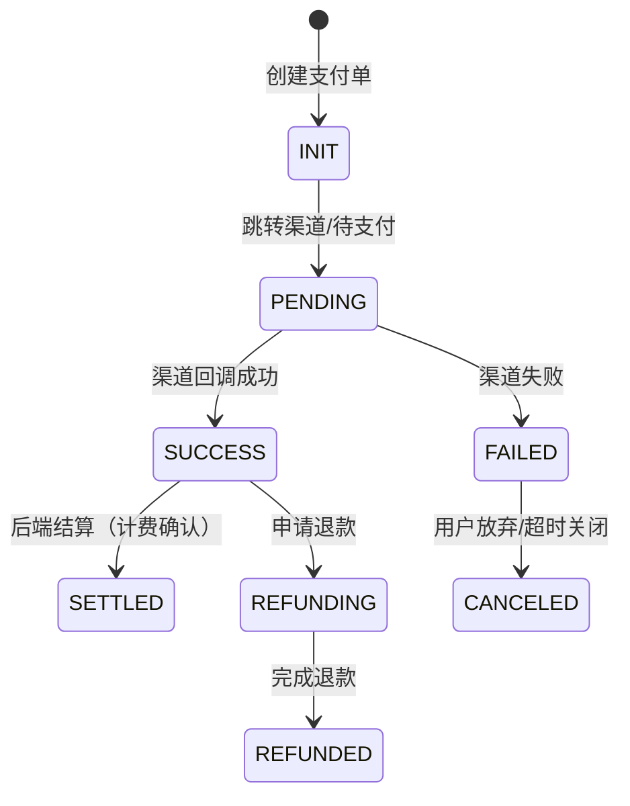
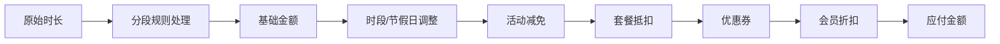

# 业务流程与状态机草稿

> 本文档为无人自助台球系统早期流程/状态机定义，后续评审后再稳定。使用 Mermaid 方便后续在文档或看板中渲染。

## 1. 球台状态机 (Table State Machine)

状态说明：

- Idle: 空闲
- Locked: 已被预约/锁定等待开始
- InUse: 使用中（计时中）
- PendingClose: 用户发起结束/待确认（或系统检测到长时间无动作）
- Closed: 已结束，等待结算完成（Session 归档）
- Maintenance: 维护中（不可被预约或开台）
- Error: 异常（心跳丢失 / 设备故障 / 传感器异常）

## 2. 开台（即时）流程

## 3. 预约流程

## 4. 关台与计费流程

## 5. 分摊支付（拼单）逻辑（概要）

## 6. 工单流程（简化）

## 7. 支付/结算状态流

## 8. 计费计算顺序（逻辑图）

## 9. 关键时序事件（Event List）

| 事件 | 触发来源 | 主体 | 用途 | 下游消费示例 |
|------|----------|------|------|--------------|
| TableHeartbeat | 设备网关 | 球台 | 在线监控 | 在线率统计、告警 |
| SessionStarted | 开台API | 台次会话 | 计费起点 | 计费引擎、增长埋点 |
| SessionEndedRequest | 用户操作 | 台次会话 | 进入冻结 | 支付流程 |
| BillingFrozen | 计费引擎 | 台次会话 | 产生金额 | 支付单生成 |
| PaymentCreated | 支付API | 支付单 | 渠道调起 | 风控、对账 |
| PaymentSucceeded | 支付回调 | 支付单 | 资金确认 | 结算、LTV 统计 |
| SessionClosed | 计费引擎 | 台次会话 | 会话归档 | 数据仓入仓 |
| AlarmRaised | 监控/检测 | 告警 | 运维响应 | 工单系统 |
| WorkOrderCreated | 系统/人工 | 工单 | 维护追踪 | KPI 统计 |

## 10. 后续补充

- 添加多门店跨表调度流程
- 增加风控逃费判定时序
- 分摊支付的并发与锁策略

---
> 若需生成 PNG / SVG，可以后续在 CI 中调用 Mermaid CLI (mmdc) 统一产出。

## 11. 相关文档导航

- [PRD](../prd/PRD.md)
- [数据库概念模型](database-schema.md)
- [埋点追踪方案](../analytics/tracking-plan.md)
