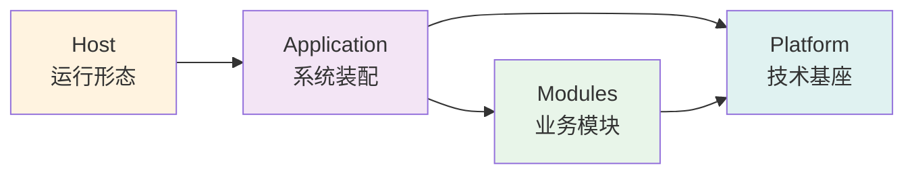

# 快速开始指南

> ⚠️ **无裁决力声明**：本文档仅供参考，不具备架构裁决权。
> 所有架构决策以相关 ADR 正文为准。详见 [ADR 目录](adr/README.md)。

**版本**：1.0  
**最后更新**：2026-01-22

---

## 🎯 选择你的路径

### 极速上手（15 分钟）⚡

适合：需要立即运行项目的开发者

**目标**：克隆、构建、验证环境

→ [跳转到极速上手](#-极速上手15-分钟)

---

### 完整入门（60 分钟）📚

适合：新加入团队的开发者

**目标**：理解架构、探索代码、准备开发

→ [跳转到完整入门](#-完整入门60-分钟)

---

### 进阶学习路径（1-4 周）🎓

适合：需要深入理解架构的开发者

**目标**：掌握所有 ADR、独立开发、贡献代码

→ [跳转到学习路径](#-学习路径建议)

---

## ⚡ 极速上手（15 分钟）

> 💡 **目标**：让你的本地环境可以运行并通过架构测试

### 1. 克隆仓库（2 分钟）

```bash
git clone https://github.com/douhuaa/Zss.BilliardHall.git
cd Zss.BilliardHall
```

### 2. 一键构建（5 分钟）

```bash
# 恢复依赖 + 构建 + 测试
dotnet restore && dotnet build && dotnet test src/tests/ArchitectureTests/
```

**预期结果**：

```
✅ Build succeeded
✅ Passed! - Architecture Tests
```

### 3. 启动应用（可选，5 分钟）

```bash
# 启动 Web API
dotnet run --project src/Host/Web/

# 访问 Swagger
# http://localhost:5000/swagger
```

### 4. 验证完成（3 分钟）

- [ ] 架构测试通过
- [ ] 应用可以启动
- [ ] 可以访问 Swagger UI

**🎉 完成！** 你的环境已就绪。

**下一步**：

- 浏览代码？ → 继续阅读 [完整入门](#-完整入门60-分钟)
- 开始开发？ → 查看 [开发指南](architecture-guide.md)
- 遇到问题？ → 查看 [常见问题](#-获取帮助)

---

## 📚 完整入门（60 分钟）

> 💡 **目标**：理解核心架构、探索代码、启用工具

### 第一步：理解项目（15 分钟）

#### 📋 前置要求

在开始之前，请确保已安装：

- **.NET 10.0 SDK** 或更高版本（`dotnet --version`）
- **Git**（`git --version`）
- **IDE**：Visual Studio 2022+ / JetBrains Rider / VS Code + C# Dev Kit
- **PostgreSQL**（可选，本地开发可跳过）

#### 核心概念速览（10 分钟）

### 核心概念速览

#### 1. 模块化单体

项目按业务能力划分为独立模块：

```
src/Modules/
├── Members/    # 会员管理
└── Orders/     # 订单管理
```

**关键规则**：

- ❌ 模块之间不能直接引用
- ✅ 通过事件、契约或原始类型通信

#### 2. 垂直切片

每个功能按垂直切片组织：

```
UseCases/
  CreateOrder/
    ├── CreateOrder.cs              # Command
    ├── CreateOrderHandler.cs        # Handler
    └── CreateOrderEndpoint.cs       # HTTP 适配器
```

**关键规则**：

- ❌ 不要创建横向 Service 层
- ✅ 每个用例是完整的垂直切片

#### 3. 三层启动体系



- **Platform**：技术能力（日志、健康检查等）
- **Application**：模块装配（业务能力拼装）
- **Host**：运行形态（Web API、Worker 等）

### 必读文档（10 分钟）

在继续之前，快速浏览这些文档：

1. **[架构指南前 3 章](architecture-guide.md)** （5 分钟）
  - 架构概述
  - 核心原则
  - 目录结构

2. **[ADR-0001](adr/constitutional/ADR-0001-modular-monolith-vertical-slice-architecture.md)** （5 分钟）
  - 模块化单体决策
  - 垂直切片决策

📌 **提示**：不需要完全理解，先有个印象即可。

---

## 💻 第三步：探索代码（20 分钟）

### 浏览 Members 模块

```bash
cd src/Modules/Members
```

#### 目录结构

```
Members/
├── UseCases/
│   └── RechargeBalance/
│       ├── RechargeBalance.cs          # Command
│       ├── RechargeBalanceHandler.cs    # Handler
│       └── RechargeBalanceEndpoint.cs   # Endpoint
├── Domain/
│   └── Member.cs                        # 领域模型
└── MembersModuleBootstrapper.cs        # 模块启动器
```

#### 查看一个完整用例

打开 `UseCases/RechargeBalance/` 目录：

**1. Command（RechargeBalance.cs）**

```csharp
public record RechargeBalance(Guid MemberId, decimal Amount);
```

- 简单的数据载体
- 不包含业务逻辑

**2. Handler（RechargeBalanceHandler.cs）**

```csharp
public class RechargeBalanceHandler : ICommandHandler<RechargeBalance>
{
    public async Task Handle(RechargeBalance command)
    {
        // 1. 加载领域模型
        var member = await _repository.LoadAsync(command.MemberId);
        
        // 2. 执行业务逻辑
        member.Recharge(command.Amount);
        
        // 3. 保存状态
        await _repository.SaveAsync(member);
    }
}
```

- Handler 是用例的权威
- 编排领域模型
- 不包含业务逻辑（在领域模型中）

**3. Endpoint（RechargeBalanceEndpoint.cs）**

```csharp
builder.MapPost("/members/{id}/recharge", async (
    Guid id,
    RechargeRequest request,
    IMessageBus bus) =>
{
    // 仅做映射
    var command = new RechargeBalance(id, request.Amount);
    await bus.InvokeAsync(command);
    return Results.Ok();
});
```

- 薄适配器
- 仅做 HTTP → Command 映射
- 不包含业务逻辑

#### 关键观察

- ✅ 业务逻辑在 `Domain/Member.cs` 中
- ✅ Handler 编排，不做决策
- ✅ Endpoint 仅做映射
- ✅ 一个用例 = 一个完整切片

---

## 🧪 第四步：运行测试（10 分钟）

### 1. 运行所有测试

```bash
# 从项目根目录
dotnet test
```

### 2. 运行特定模块测试

```bash
dotnet test tests/Modules.Members.Tests/
```

### 3. 查看测试结构

```bash
cd src/tests
ls -la
```

输出：

```
ArchitectureTests/        # 架构测试
Modules.Members.Tests/    # Members 单元测试
Modules.Orders.Tests/     # Orders 单元测试
```

### 4. 理解测试组织

测试镜像源代码结构：

```
src/Modules/Members/UseCases/RechargeBalance/
tests/Modules.Members.Tests/UseCases/RechargeBalance/
```

---

## 🤖 第五步：启用 Copilot（5 分钟）

GitHub Copilot 是本项目的架构守护者。

### 1. 了解 Copilot 角色

阅读：[Copilot 角色定位](copilot/README.md)（3 分钟）

### 2. 测试 Copilot

在 IDE 中打开 Copilot Chat，询问：

```
我想在 Members 模块中添加一个新的用例，有哪些架构约束？
```

**预期回复**：
Copilot 会解释 ADR-0001 和 ADR-0005 的约束，并给出具体步骤。

### 3. 浏览 Copilot 文档

快速浏览：

- [.github/instructions/](../.github/instructions/README.md) - Copilot 行为边界
- [docs/copilot/](copilot/) - Copilot Prompts 库

---

## 🛠️ 下一步（可选）

### 运行应用

```bash
# 启动 Web API
dotnet run --project src/Host/Web/

# 访问
# http://localhost:5000/swagger
```

### 开发新功能

尝试添加一个简单的查询：

1. 在 Members 模块中创建 `GetMemberById` 用例
2. 参考 `RechargeBalance` 的结构
3. 运行架构测试验证
4. 询问 Copilot 获取帮助

### 探索更多

- 📘 [完整架构指南](architecture-guide.md)
- 📋 [所有 ADR](adr/README.md)
- 🧪 [测试完整指南](TESTING-GUIDE.md)
- 🤖 [Copilot 完整指南](copilot/README.md)

---

## ✅ 完成检查清单

恭喜！如果你已经完成以下内容，说明快速开始成功：

- [x] 克隆并构建项目
- [x] 运行架构测试并通过
- [x] 理解核心架构概念
- [x] 浏览了完整的用例示例
- [x] 运行了测试
- [x] 启用了 Copilot

---

## 🎯 学习路径建议

### 第 1 周：理解架构

- [ ] 阅读所有宪法层 ADR（ADR-0001~0005）
- [ ] 浏览所有模块的 README
- [ ] 理解模块间通信方式
- [ ] 运行和调试应用

### 第 2 周：开始开发

- [ ] 在现有模块中添加简单用例
- [ ] 学习使用 Copilot 辅助开发
- [ ] 理解架构测试体系
- [ ] 提交第一个 PR

### 第 3-4 周：独立贡献

- [ ] 独立开发新功能
- [ ] 参与 Code Review
- [ ] 贡献文档改进
- [ ] 帮助其他新成员

---

## 🆘 获取帮助

### 遇到问题？

1. **架构问题**
  - 查阅相关 ADR
  - 询问 Copilot
  - 在 Issue 中提问

2. **技术问题**
  - 检查环境配置
  - 查看错误信息
  - 搜索已知 Issue

3. **测试失败**
  - 复制失败日志
  - 询问 Copilot 诊断
  - 查看 [测试故障诊断](copilot/architecture-test-failures.md)

### 联系方式

- **GitHub Issues**: https://github.com/douhuaa/Zss.BilliardHall/issues
- **Team Channel**: [团队沟通渠道]

---

## 📚 推荐阅读顺序

### 必读（第 1 周）

1. 本文档（你正在读）
2. [架构指南](architecture-guide.md)
3. [ADR-0001](adr/constitutional/ADR-0001-modular-monolith-vertical-slice-architecture.md)
4. [ADR-0002](adr/constitutional/ADR-0002-platform-application-host-bootstrap.md)
5. [ADR-0005](adr/constitutional/ADR-0005-Application-Interaction-Model-Final.md)

### 扩展阅读（第 2 周）

6. [ADR-0003](adr/constitutional/ADR-0003-namespace-rules.md)
7. [ADR-0004](adr/constitutional/ADR-0004-Cpm-Final.md)
8. [ADR-900](adr/governance/ADR-900-architecture-tests.md)
9. [测试完整指南](TESTING-GUIDE.md)
10. [CI/CD 指南](ci-cd-guide.md)

### 进阶阅读（第 3 周+）

11. [架构自动化验证系统](architecture-automation-verification.md)
12. [Copilot 完整指南](copilot/README.md)
13. [文档维护指南](DOCUMENTATION-MAINTENANCE.md)
14. [改进总结](summaries/README.md)

---

## 🎉 欢迎加入

恭喜你完成快速开始！

现在你已经：

- ✅ 拥有可工作的开发环境
- ✅ 理解了核心架构概念
- ✅ 知道如何查找文档
- ✅ 知道如何使用 Copilot

准备好开始贡献了！🚀

---

**下一步**：浏览 [文档导航中心](index.md) 找到你需要的其他资源

---

## 📜 版本历史

| 版本  | 日期         | 变更说明 |
|-----|------------|------|
| 1.0 | 2026-01-22 | 初始版本 |

---

**维护人**：架构团队  
**反馈**：欢迎通过 Issue 或 PR 提供反馈
