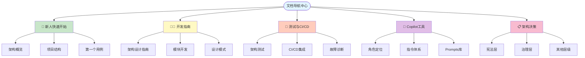
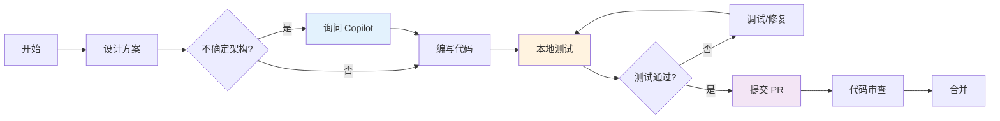
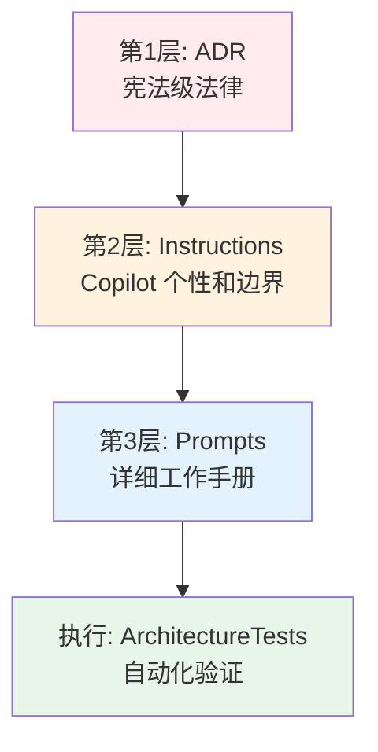

# 📚 文档导航中心

**最后更新**：2026-01-22  
**版本**：1.0

---

## 🎯 快速导航

### 按角色查找

<table>
<tr>
<td width="50%">

#### 👨‍💻 开发者

- **入门** → [快速开始](#-新人快速开始)
- **开发** → [开发指南](#-开发指南)
- **测试** → [测试指南](#-测试与-cicd)
- **工具** → [Copilot 助手](#-copilot-工具)

</td>
<td width="50%">

#### 🏗️ 架构师 / Tech Lead

- **架构** → [架构设计](#-架构设计)
- **决策** → [ADR 索引](#-架构决策记录-adr)
- **治理** → [架构治理](#-架构治理)
- **改进** → [改进总结](#-改进总结)

</td>
</tr>
<tr>
<td width="50%">

#### 🧪 QA / 测试工程师

- **测试** → [测试完整指南](#-测试与-cicd)
- **CI/CD** → [CI/CD 集成](#-cicd-集成)
- **故障** → [测试失败诊断](#-测试失败诊断)

</td>
<td width="50%">

#### 🔧 DevOps / SRE

- **部署** → [部署指南](#-运维部署)
- **CI/CD** → [CI/CD 完整指南](#-cicd-集成)
- **监控** → [架构验证系统](#-自动化验证系统)

</td>
</tr>
</table>

### 按任务查找

| 我想...             | 查看文档                                                                        |
|-------------------|-----------------------------------------------------------------------------|
| 🚀 **快速了解项目**     | [README](../README.md) → [架构概览](architecture-guide.md)                      |
| 📖 **学习架构决策**     | [ADR 目录](adr/README.md)                                                     |
| 💻 **开发新功能**      | [架构指南](architecture-guide.md) → [模块开发](#-模块开发指南)                            |
| 🧪 **运行测试**       | [架构测试指南](#-架构测试) → [CI/CD 指南](ci-cd-guide.md)                               |
| ❌ **处理测试失败**      | [测试失败诊断](#-测试失败诊断) → [Copilot 诊断](copilot/architecture-test-failures.md)    |
| 🤖 **使用 Copilot** | [Copilot 角色定位](copilot/README.md) → [Prompts 库](copilot/)                   |
| 🔍 **查看改进历史**     | [改进总结](summaries/README.md)                                                 |
| 📝 **提交 PR**      | [PR 模板](../.github/PULL_REQUEST_TEMPLATE.md) → [Copilot 评审](#-copilot-参与评审) |

### 角色-任务-文档映射表

| 角色         | 典型任务     | 主要文档                                                                                                                      | 协作文档                                                                                                                                                                    |
|------------|----------|---------------------------------------------------------------------------------------------------------------------------|-------------------------------------------------------------------------------------------------------------------------------------------------------------------------|
| **开发者**    | 开发新功能    | [架构指南](architecture-guide.md), [模块 README](../src/Modules/)                                                               | [ADR-0001](adr/constitutional/ADR-0001-modular-monolith-vertical-slice-architecture.md), [ADR-0005](adr/constitutional/ADR-0005-Application-Interaction-Model-Final.md) |
| **开发者**    | 修复 bug   | [测试指南](TESTING-GUIDE.md), [架构测试失败诊断](copilot/architecture-test-failures.md)                                               | [CI/CD 指南](ci-cd-guide.md)                                                                                                                                              |
| **开发者**    | 提交 PR    | [PR 模板](../.github/PULL_REQUEST_TEMPLATE.md), [文档维护指南](DOCUMENTATION-MAINTENANCE.md)                                      | [Copilot 评审](copilot/pr-review-pipeline.md)                                                                                                                             |
| **架构师**    | 制定架构决策   | [ADR-0900](adr/governance/ADR-0900-adr-process.md), [宪法层说明](adr/constitutional/README.md)                                 | [架构指南](architecture-guide.md)                                                                                                                                           |
| **架构师**    | 架构评审     | [ADR 目录](adr/README.md), [架构测试](../src/tests/ArchitectureTests/README.md)                                                 | [违规记录](summaries/arch-violations.md)                                                                                                                                    |
| **QA/测试**  | 编写测试     | [测试指南](TESTING-GUIDE.md), [.github/instructions/testing.instructions.md](../.github/instructions/testing.instructions.md) | [架构测试 README](../src/tests/ArchitectureTests/README.md)                                                                                                                 |
| **QA/测试**  | 调查测试失败   | [架构测试失败诊断](copilot/architecture-test-failures.md), [测试指南-故障处理](TESTING-GUIDE.md#-测试失败处理流程)                                | [Copilot Prompts](copilot/)                                                                                                                                             |
| **DevOps** | 配置 CI/CD | [CI/CD 指南](ci-cd-guide.md), [架构自动化验证](architecture-automation-verification.md)                                            | [GitHub Actions](../.github/workflows/)                                                                                                                                 |
| **DevOps** | 监控健康度    | [文档健康度度量](DOCUMENTATION-MAINTENANCE.md#-文档健康度度量)                                                                          | [ADR-0000](adr/governance/ADR-0000-architecture-tests.md)                                                                                                               |
| **新成员**    | 快速入门     | [快速开始](QUICK-START.md), [README](../README.md)                                                                            | [架构指南前3章](architecture-guide.md)                                                                                                                                        |
| **新成员**    | 理解架构     | [ADR-0001~0005](adr/constitutional/), [架构指南](architecture-guide.md)                                                       | [Copilot 角色定位](copilot/README.md)                                                                                                                                       |

> 💡 **使用提示**：此映射表帮助团队成员快速定位跨角色协作所需的文档，减少沟通成本。

---

## 📖 文档结构总览



---

## 🚀 新人快速开始

> 💡 **完整指南**：查看 **[快速开始指南 (QUICK-START.md)](QUICK-START.md)** 获取 60 分钟完整入门教程

### 第一步：理解项目（10 分钟）

1. 📄 [快速开始指南](QUICK-START.md) - 60 分钟完整入门
2. 📄 [项目 README](../README.md) - 项目概述、技术栈
3. 📐 [架构指南](architecture-guide.md) - 架构概述（重点阅读前 3 章）
4. 🏛️ [ADR-0001](adr/constitutional/ADR-0001-modular-monolith-vertical-slice-architecture.md) - 核心架构决策

### 第二步：环境搭建（15 分钟）

```bash
# 克隆仓库
git clone https://github.com/douhuaa/Zss.BilliardHall.git
cd Zss.BilliardHall

# 恢复依赖
dotnet restore

# 构建项目
dotnet build

# 运行架构测试（验证环境）
dotnet test src/tests/ArchitectureTests/ArchitectureTests.csproj
```

### 第三步：探索代码（20 分钟）

1. 📁 查看 [Members 模块](../src/Modules/Members/README.md) 示例
2. 📁 查看 [Orders 模块](../src/Modules/Orders/README.md) 示例
3. 🔍 浏览一个完整的 Use Case（如 `CreateMember`）

### 第四步：启用 Copilot（5 分钟）

1. 🤖 阅读 [Copilot 角色定位](copilot/README.md)
2. 📚 浏览 [.github/instructions/](../.github/instructions/README.md) 了解 Copilot 行为
3. 💬 在 IDE 中询问 Copilot："请解释本项目的架构约束"

### 学习路径建议

**第 1 周**：

- [ ] 阅读所有宪法层 ADR（ADR-0001 ~ 0005）
- [ ] 理解模块隔离和垂直切片
- [ ] 完成第一个简单用例

**第 2 周**：

- [ ] 学习模块间通信方式
- [ ] 理解架构测试体系
- [ ] 参与 PR Review

**第 3-4 周**：

- [ ] 独立开发新功能
- [ ] 使用 Copilot 辅助开发
- [ ] 贡献文档改进

---

## 👨‍💻 开发指南

### 核心文档

- 📘 **[快速开始指南](QUICK-START.md)** - 60 分钟快速入门
- 📘 **[架构设计指南](architecture-guide.md)** - 完整架构说明
- 📋 **[架构决策记录 (ADR)](adr/README.md)** - 所有架构决策
- 🏗️ **[模块开发指南](#-模块开发指南)** - 如何开发业务模块

### 模块开发指南

#### Members 模块

- 📁 [模块 README](../src/Modules/Members/README.md)
- 💡 **职责**：会员管理、余额充值
- 📦 **示例用例**：`RechargeBalance`、`CreateMember`

#### Orders 模块

- 📁 [模块 README](../src/Modules/Orders/README.md)
- 💡 **职责**：订单管理
- 📦 **示例用例**：`CreateOrder`

#### Platform.Contracts

- 📁 [Contracts 使用指南](../src/Platform/Contracts/README.md)
- 💡 **职责**：模块间数据契约
- 📦 **规则**：只读 DTO，禁止业务逻辑

### 开发工作流



### 关键约束

| ❌ 禁止                   | ✅ 正确做法                    |
|------------------------|---------------------------|
| 模块间直接引用                | 通过事件、契约或原始类型通信            |
| 创建横向 Service 层         | 按垂直切片组织 Use Case          |
| Command Handler 返回业务数据 | 仅返回 ID，使用单独的 Query        |
| Endpoint 包含业务逻辑        | Endpoint 仅做映射，逻辑在 Handler |

---

## 🧪 测试与 CI/CD

> 💡 **完整指南**：查看 **[测试完整指南 (TESTING-GUIDE.md)](TESTING-GUIDE.md)** 获取所有测试相关信息

### 架构测试

- 📘 **[测试完整指南](TESTING-GUIDE.md)** - 所有测试类型的完整说明
- 📘 **[架构测试 README](../src/tests/ArchitectureTests/README.md)** - 测试说明
- 🏛️ **[ADR-0000](adr/governance/ADR-0000-architecture-tests.md)** - 架构测试治理

**运行测试**：

```bash
# 运行所有架构测试
dotnet test src/tests/ArchitectureTests/

# 运行特定 ADR 测试
dotnet test --filter "FullyQualifiedName~ADR_0001"
```

### CI/CD 集成

- 📘 **[CI/CD 指南](ci-cd-guide.md)** - CI 流程和本地开发
- 🤖 **[自动化验证系统](architecture-automation-verification.md)** - 三层防御体系

**CI 流程**：

1. 构建项目
2. 运行架构测试（失败 = 阻断）
3. 运行单元测试
4. 合并 PR

### 测试失败诊断

- 🩺 **[Copilot 诊断指南](copilot/architecture-test-failures.md)** - 如何诊断架构测试失败
- 📋 **[常见失败模式](#-常见测试失败模式)** - 典型问题和解决方案

#### 快速诊断流程

```bash
# 1. 复制测试失败日志
dotnet test src/tests/ArchitectureTests/ > test-failure.log

# 2. 询问 Copilot
"请根据以下架构测试失败日志，解释违规原因并提供修复建议：
[粘贴失败日志]"

# 3. 根据建议修复
# 4. 重新运行测试
dotnet test src/tests/ArchitectureTests/
```

### 常见测试失败模式

| 测试失败           | 原因                     | 修复方案                        | 相关 ADR   |
|----------------|------------------------|-----------------------------|----------|
| 模块依赖违规         | 模块间直接引用                | 使用事件/契约                     | ADR-0001 |
| 命名空间违规         | 手动覆盖 RootNamespace     | 删除覆盖，使用默认规则                 | ADR-0003 |
| 包版本违规          | 项目中指定版本                | 移到 Directory.Packages.props | ADR-0004 |
| Handler 返回类型违规 | Command Handler 返回 DTO | 仅返回 ID                      | ADR-0005 |

---

## 🤖 Copilot 工具

### 角色定位

- 📘 **[Copilot 在本项目的角色](copilot/README.md)** - 核心定位和使用价值
- 🎯 **三大价值**：
  1. 架构违规的预防与诊断
  2. ADR 的人话翻译
  3. 新人 Onboarding 的第一响应者

### 三层体系



### 指令体系

- 📁 **[.github/instructions/](../.github/instructions/README.md)** - Copilot 行为边界
  - `base.instructions.md` - 核心行为（始终激活）
  - `backend.instructions.md` - 后端开发
  - `testing.instructions.md` - 测试编写
  - `documentation.instructions.md` - 文档编写
  - `architecture-review.instructions.md` - PR 评审

### Prompts 工作手册

- 📁 **[docs/copilot/](copilot/)** - 场景化提示词库
  - [ADR-0001 Prompts](copilot/adr-0001.prompts.md) - 模块隔离
  - [ADR-0002 Prompts](copilot/adr-0002.prompts.md) - 三层启动体系
  - [ADR-0003 Prompts](copilot/adr-0003.prompts.md) - 命名空间
  - [ADR-0004 Prompts](copilot/adr-0004.prompts.md) - 包管理
  - [ADR-0005 Prompts](copilot/adr-0005.prompts.md) - 交互模型
  - [架构测试失败解释](copilot/architecture-test-failures.md) - 诊断指南
  - [PR Review Pipeline](copilot/pr-review-pipeline.md) - 评审流程

### Copilot 参与评审

**PR 提交前检查清单**（必填）：

- [ ] ✅ 已使用 Copilot 基于 ADR 审查架构合规性
- [ ] ✅ Copilot 未发现违规问题或已修复
- [ ] ✅ 已评估并采纳 Copilot 的合理建议
- [ ] ✅ 已在本地运行架构测试并通过

**如何使用 Copilot 评审**：

```
询问 Copilot：
"请基于 ADR-0001 至 ADR-0005 审查本 PR 的变更，检查是否存在架构违规。

变更文件：
[列出变更的文件]
"
```

---

## 📋 架构决策记录 (ADR)

### ADR 索引

- 📁 **[ADR 完整目录](adr/README.md)** - 所有 ADR 的导航和索引

### 按层级浏览

#### 🏛️ 宪法层（ADR-0001~0009）

系统根基，不可推翻，只能细化

| ADR                                                                                     | 标题                               | 关键内容                          |
|-----------------------------------------------------------------------------------------|----------------------------------|-------------------------------|
| [ADR-0001](adr/constitutional/ADR-0001-modular-monolith-vertical-slice-architecture.md) | 模块化单体与垂直切片                       | 模块划分、垂直切片、模块隔离                |
| [ADR-0002](adr/constitutional/ADR-0002-platform-application-host-bootstrap.md)          | Platform/Application/Host 三层启动体系 | 三层装配、依赖方向、目录结构                |
| [ADR-0003](adr/constitutional/ADR-0003-namespace-rules.md)                              | 命名空间与项目边界规范                      | 命名空间规则、MSBuild 策略             |
| [ADR-0004](adr/constitutional/ADR-0004-Cpm-Final.md)                                    | 中央包管理（CPM）                       | Directory.Packages.props、层级依赖 |
| [ADR-0005](adr/constitutional/ADR-0005-Application-Interaction-Model-Final.md)          | 应用内交互模型与执行边界                     | Use Case、Handler、CQRS         |

#### 🛡️ 治理层（ADR-0000, 900~999）

架构治理、流程规范、破例管理

| ADR                                                       | 标题          | 关键内容               |
|-----------------------------------------------------------|-------------|--------------------|
| [ADR-0000](adr/governance/ADR-0000-architecture-tests.md) | 架构测试与 CI 治理 | 测试定义、ADR-测试映射、破例流程 |
| [ADR-0900](adr/governance/ADR-0900-adr-process.md)        | ADR 新增与修订流程 | ADR 生命周期、修订流程      |

#### 📐 其他层级

- **结构层**（ADR-100~199）：静态结构细化（未来扩展）
- **运行层**（ADR-200~299）：运行时行为细化（未来扩展）
- **技术层**（ADR-300~399）：技术选型和实现（未来扩展）

### 按角色推荐阅读

| 角色           | 必读 ADR                     | 选读 ADR               |
|--------------|----------------------------|----------------------|
| 新成员          | ADR-0001, 0002, 0005, 0900 | ADR-0000, 0003, 0004 |
| 前端开发         | ADR-0001, 0005             | ADR-0002             |
| 后端开发         | 全部宪法层 + ADR-0900           | 各细化层（按需）             |
| DevOps / SRE | ADR-0000, 0002, 0004, 0900 | ADR-0001, 0003, 0005 |
| 架构师          | 全部                         | -                    |

---

## 🏗️ 架构治理

### 改进总结

- 📁 **[改进总结目录](summaries/README.md)** - 项目改进历程（扁平化结构，所有文件位于同一目录）

#### 架构改进

- [ADR 重组总结](summaries/adr-restructure-summary.md) - ADR 体系重组
- [ADR 编号优化总结](summaries/adr-numbering-optimization-summary.md) - 编号体系优化

#### 测试改进

- [架构测试体系改进总结](summaries/architecture-tests-improvement-summary.md) - 测试体系升级

#### 治理改进

- [架构违规记录表](summaries/arch-violations.md) - 破例管理

### Copilot 治理实施

- [Copilot 治理实施总结](summaries/copilot-governance-implementation.md) - Copilot 驱动架构治理

---

## 🔧 运维部署

### 环境要求

- .NET 10.0 或更高版本
- PostgreSQL（用于 Marten 数据库）

### 运行应用

```bash
# 启动 Web API
dotnet run --project src/Host/Web/Web.csproj

# 启动 Worker
dotnet run --project src/Host/Worker/Worker.csproj
```

### CI/CD

- 🔧 **[.github/workflows/](../.github/workflows/)** - GitHub Actions 工作流
- 📘 **[CI/CD 指南](ci-cd-guide.md)** - 详细集成说明

---

## 📊 文档统计

### 文档数量

- **总文档数**：34+ Markdown 文件
- **ADR 文档**：12 个
- **Copilot 文档**：8 个
- **模块文档**：3 个

### 覆盖领域

- ✅ 架构设计
- ✅ 开发指南
- ✅ 测试体系
- ✅ CI/CD 集成
- ✅ Copilot 工具
- ✅ 治理流程
- ⚠️ 性能优化（待补充）
- ⚠️ 安全指南（待补充）

---

## 💡 使用建议

### 如何使用本文档

1. **首次访问**：按角色或任务使用快速导航
2. **日常使用**：收藏本页面作为文档入口
3. **深入学习**：按层级浏览完整文档

### 文档反馈

如发现以下问题，请提交 Issue 或 PR：

- 文档链接失效
- 内容过时或错误
- 缺少重要文档
- 导航不清晰

---

## 🔗 相关链接

### 内部资源

- [项目主页 README](../README.md)
- [GitHub 仓库](https://github.com/douhuaa/Zss.BilliardHall)
- [PR 模板](../.github/PULL_REQUEST_TEMPLATE.md)

### 外部参考

- [Vertical Slice Architecture - Jimmy Bogard](https://www.jimmybogard.com/vertical-slice-architecture/)
- [Modular Monolith - Kamil Grzybek](https://www.kamilgrzybek.com/blog/posts/modular-monolith-primer)
- [NetArchTest.Rules](https://github.com/BenMorris/NetArchTest)

---

**维护人**：架构团队  
**下次评审**：2026-04-22  
**文档版本**：1.0
