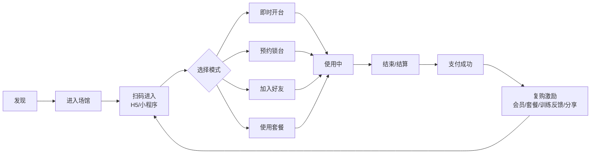

# 无人自助台球系统 Product Story

> 版本：v0.1  
> 最近更新：2025-09-21  
> 目的：以“用户价值 → 业务价值 → 系统能力”叙述方式，为 PRD/设计/研发提供统一的语义上下文。

## 1. 一句话愿景

让台球场馆像共享健身仓一样无人自助运行：扫码即用、自动计费、数据驱动增长、低人力可复制。

## 2. Why（问题与机会）

| 现状痛点 | 影响 | 机会 |
|----------|------|------|
| 人工开台/手动计费 | 成本高、易出错 | 自动计时+规则引擎 |
| 运营拍脑袋定价 | 利用率低峰谷差大 | 精细/动态分时定价 |
| 设备维护滞后 | 离线丢单/体验差 | 数据监控+预测维护 |
| 用户体验割裂 | 预约/开台/支付多环节摩擦 | 无缝扫码→使用→结算闭环 |
| 缺少复购机制 | 新用户流失高 | 会员/套餐/数据反馈/AI 附加值 |
| 缺乏可视化数据 | 决策慢 | 看板+指标体系支撑扩张 |

## 3. Who（角色画像）

### 3.1 核心角色

| 角色 | 目标 | 核心诉求 | 价值衡量 |
|------|------|----------|----------|
| 临时用户 | 快速开玩 | 无需学习/免等待 | 首次开台转化率 |
| 练习型用户 | 高频训练 | 低价/数据反馈 | 月使用时长/续费率 |
| 发起者（组局） | 组织多人 | 快速邀请/分摊 | 人均时长/拼单率 |
| 会员用户 | 降本 & 优先权益 | 折扣/预约保障 | 会员渗透/ARPPU |
| 场馆运营者 | 提升营收 | 利用率/活动效果 | 单台产出/坪效 |
| 设备维护员 | 快速处置 | 状态透明/远程诊断 | MTTA / MTTR |
| 区域/连锁管理者 | 规模复制 | 多门店对比/异常预警 | 门店KPI对比/扩张速度 |

### 3.2 补充角色

市场推广、财务、风控、安全、数据分析师、广告合作方、AI 训练服务模块（增值）。

## 4. 用户价值主张（UVP）

| 用户类型 | 核心价值 | 辅助价值 | 长期护城河 |
|----------|----------|----------|--------------|
| 普通玩家 | 随到随玩/公平透明计费 | 拼单/社交 | 数据沉淀+升级体系 |
| 练习/进阶 | 训练效率提升 | 姿势/走位反馈 | AI 训练模型精度 |
| 运营方 | 降本增效 | 精细运营（定价+营销） | 多门店 SaaS 与数据网络效应 |
| 连锁管理 | 可视化复制 | 标准化 SOP | 指标基线 + 异常模型 |
| 广告/合作 | 触达精准受众 | 互动转化位 | 设备终端流量聚合 |

## 5. 用户旅程（分层拆解）

## 6. 关键用户故事（精选）

格式：作为【角色】，我想【目标】，以便【价值】。

### 6.1 开台与体验

- 作为临时用户，我想扫码免注册体验 5 分钟，以判断是否继续使用。
- 作为发起者，我想邀请好友扫码加入当前台次，并自动按时长分摊费用，避免手动算钱。
- 作为练习型用户，我想看到我本月累计有效练习时长与峰值连续天数，以激励坚持。

### 6.2 预约与保障

- 作为会员，我想在高峰前 24 小时预约并获得优先锁台，确保组局成功。
- 作为临时用户，如果预约未在 10 分钟内激活，我希望系统自动释放避免资源浪费。

### 6.3 计费与透明

- 作为价格敏感用户，我希望进台前看到当前时段单价与预计 1 小时费用。
- 作为用户，我希望在使用中实时看到“当前应付（未含优惠）+ 预计最终费用区间”。

### 6.4 支付与分摊

- 作为组局用户，我希望在结算时可一键发起“AA 支付”链接，剩余未支付部分由我兜底。

### 6.5 会员与套餐

- 作为高频用户，我希望有“包 30 小时”套餐并支持分次抵扣，查看剩余分钟与预估可用天数。

### 6.6 运维与告警

- 作为维护员，我希望收到“某台 15 分钟无动作但仍亮灯”提示，避免空耗。

### 6.7 风控与安全

- 作为风控，我希望系统识别“结束时间与灯灭时间差异常”并标记疑似逃费。

### 6.8 数据与经营

- 作为运营，我希望看到日历热力图（每天各时间段利用率）以调整定价策略。

## 7. 功能地图（Capabilities Map）

| 层级 | 能力域 | 子能力 | MVP | 增强 | 长期 |
|------|--------|--------|-----|------|------|
| 核心业务 | 开台管理 | 扫码开台 / 预约 / 状态机 | ✔ | 分摊 / 锁台保护 | 多模式(赛事) |
| 核心业务 | 计费 | 分段 / 时段 | ✔ | 动态定价 | 价格弹性预测 |
| 核心业务 | 支付 | 主扫/被扫渠道 | ✔ | 分摊/套餐抵扣 | 多方分账 |
| 增长 | 营销 | 首单 / 时段优惠 | ✔ | 拼团 / 满减 / 裂变 | AI 推荐策略 |
| 增长 | 会员套餐 | 等级 / 折扣 | ✔ | 连续打卡激励 | 行为驱动权益 |
| 增长 | 训练反馈 | （占位） | ✖ | 姿势/统计初版 | AI 战术分析 |
| 设备 | 在线监测 | 心跳 / 灯控 | ✔ | 远程批量操作 | 自愈策略 |
| 设备 | 维护 | 手动工单 | ✔ | SLA + 智能派单 | 预测性维护 |
| 风控 | 逃费识别 | 基础规则 | ✔ | 行为模型 | 视频 AI 判别 |
| 数据 | 指标报表 | 营收/利用率 | ✔ | 用户分层 | LTV / 预测 |
| 平台 | 权限租户 | RBAC 门店作用域 | ✔ | API Key | Open API 生态 |

## 8. 差异化亮点（Pitch Bullets）

- 真无人：灯控+心跳+规则+自愈脚本 → 减低人力 50%+
- 精细定价：分钟级 + 分段 + 时段 + 动态调优
- 多维数据：利用率热力、转化漏斗、生命周期评分
- 增值延展：AI 姿势/走位反馈形成训练闭环
- 风控护城河：行为 & 设备多源融合识别逃费

## 9. 关键指标映射（北极星与支持指标）

| 维度 | 北极星/主指标 | 支撑指标 | 说明 |
|------|---------------|----------|------|
| 用户增长 | 新用户首开转化率 | 扫码→注册、注册→开台 | 入口体验质量 |
| 使用深度 | 单用户月开台时长 | 平均会话时长/频次 | 训练/社交黏性 |
| 变现 | 单台日营收 | 利用率、客单价 | 定价与营销合力 |
| 留存 | D30 留存 | D7 留存 / 连续打卡 | 复购体系质量 |
| 运营效率 | 人员 / 台数比 | MTTA / MTTR | 无人化成熟度 |
| 设备稳定 | 在线率 | 心跳异常率 | 设备健康 |
| 风控 | 异常占用追回率 | 逃费疑似数 | 收入保护 |

## 10. 战略里程碑（Strategy Milestones）

| 阶段 | 目标 | 核心验证 |
|------|------|----------|
| V0.1 | 可用 | 开台/计费/支付闭环稳定 |
| V0.2 | 体验提升 | 预约/套餐/告警上线 |
| V0.3 | 增长拉升 | 营销/分摊/多门店 |
| V0.4 | 风控+数据 | 利用率分析 / 逃费识别 |
| V1.0 | 复制扩张 | 动态定价+区域管理 |
| V1.5 | 增值强化 | AI 姿势反馈/训练报告 |
| V2.0 | 平台化 | 生态与开放 API |

## 11. 关键设计原则

- 透明：费用实时可见、拆解清晰
- 可扩展：规则/定价/营销皆策略化配置
- 安全可追溯：全链路事件日志 & 幂等
- 边缘容错：设备侧与云侧双计时校验
- 渐进AI：先规则后模型，逐步引入 CV/姿势识别

## 12. 典型故事落地示例

故事：匿名 5 分钟体验 → 转正。

| 维度 | 说明 |
|------|------|
| 入口 | 扫码 → 临时 token（未注册）|
| 限制 | 仅 1 次 / 设备 / 24h；最多 5 分钟 |
| 触发升级 | 倒计时 1 分钟弹窗：绑定手机号解锁继续计时 |
| 反滥用 | 设备指纹 + IP + 行为频率阈值 |
| KPI | 匿名→注册转化 > 60% |

## 13. 生态与延伸（Long Tail）

- 赛事模式：裁判计分、排行榜、赞助位
- 商业化扩展：广告曝光、球杆试用、品牌联名套餐
- 横向复制：乒乓/桌游/自助练琴房 → 统一“无人空间运营基座”

## 14. 未来潜在风控策略（提前占位）

| 场景 | 规则初版 | 未来模型 |
|------|----------|----------|
| 长时间空占台 | 灯亮+摄像头无动作 10 分钟 | 视频帧差 / 人体检测 |
| 异常频繁开关 | 1 小时内 >N 次 | 行为序列建模 |
| 疑似逃费 | 结束请求与灯灭差值 > 阈值 | 多模态融合评分 |
| 多账号薅券 | 同设备/支付标识复用 | 账户图谱聚类 |

## 15. 附录

- 与 PRD 对齐章节：功能矩阵、版本规划、指标
- 相关文档：[PRD](prd/PRD.md)、[流程与状态](design/flow-and-states.md)、[埋点方案](analytics/tracking-plan.md)

---
> 下一步：若需英文版 / Pitch Deck / API 合同，可在此基础派生。
