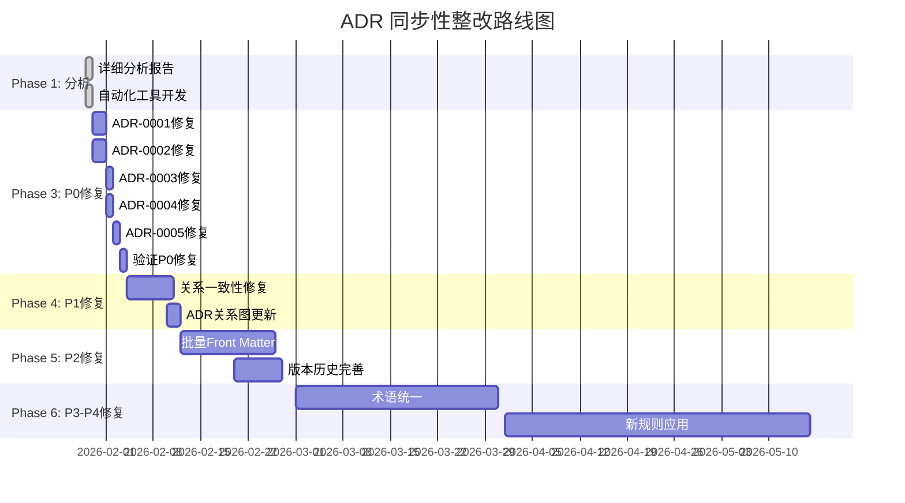

# ADR 同步性整改路线图

**生成时间**：2026-01-29  
**状态**：Phase 2 完成

---

## 整改时间线



---

## 问题优先级矩阵

```mermaid
quadrantChart
    title ADR 问题优先级矩阵
    x-axis 修复难度 低 --> 高
    y-axis 影响程度 低 --> 高
    quadrant-1 高影响-高难度 (P1)
    quadrant-2 高影响-低难度 (P0)
    quadrant-3 低影响-低难度 (P3)
    quadrant-4 低影响-高难度 (P4)
    
    宪法层Front Matter: [0.3, 0.9]
    术语表格式: [0.2, 0.7]
    关系声明不一致: [0.6, 0.8]
    版本号格式: [0.1, 0.3]
    新规则传递: [0.7, 0.6]
    术语重复定义: [0.4, 0.4]
```

---

## 问题分类与修复策略

### 🔴 P0: 宪法层不一致（极高优先级）

**影响范围**：所有依赖宪法层的 ADR 和开发者

**问题清单**：
1. ADR-0001: 缺少 Front Matter、标准术语表、快速参考表
2. ADR-0002: 缺少 Front Matter、执行级别标注
3. ADR-0003: 缺少 Front Matter、英文对照
4. ADR-0004: 缺少 Front Matter、完整关系声明
5. ADR-0005: 缺少 Front Matter、标准化格式

**修复策略**：
- ✅ 按 ADR 顺序逐个修复
- ✅ 使用标准模板（基于 ADR-902）
- ✅ 每修复一个立即验证

**时间要求**：7 天内完成（2026-02-05前）

**验证命令**：
```bash
./scripts/check-adr-consistency.sh | grep "constitutional"
```

---

### 🟠 P1: 关系声明不一致（高优先级）

**影响范围**：架构追溯和依赖分析

**问题清单**：
1. ADR-122 ↔ ADR-903 替代关系不一致
2. 多个 ADR 缺少双向关系声明
3. 关系格式不符合 ADR-940 标准

**修复策略**：
- ✅ 创建关系一致性清单
- ✅ 逐对修复不一致关系
- ✅ 更新 ADR-RELATIONSHIP-MAP.md

**时间要求**：14 天内完成（2026-02-12前）

**验证命令**：
```bash
python3 ./scripts/validate-adr-relationships.py
```

---

### 🟡 P2: 版本元数据不统一（中优先级）

**影响范围**：文档维护和版本追踪

**问题清单**：
1. 30 个 ADR 缺少 Front Matter
2. 版本历史缺少修订人和影响级别
3. 部分版本号格式不规范

**修复策略**：
- ✅ 批量添加 Front Matter
- ✅ 补充版本历史信息
- ✅ 统一版本号格式

**时间要求**：30 天内完成（2026-02-28前）

**验证命令**：
```bash
./scripts/check-adr-consistency.sh | grep "Front Matter"
```

---

### 🟢 P3: 术语使用不一致（中低优先级）

**影响范围**：术语理解和文档一致性

**问题清单**：
1. 17 个术语表缺少英文对照
2. 部分术语定义不完整
3. 术语表格式不统一

**修复策略**：
- ✅ 为所有术语表增加英文对照
- ✅ 建立权威术语表（ADR-0006）
- ✅ 清理重复定义

**时间要求**：60 天内完成（2026-03-30前）

**验证命令**：
```bash
./scripts/check-terminology.sh
```

---

### 🔵 P4: 新规则未传递（低优先级）

**影响范围**：规范完整性和长期维护

**问题清单**：
1. ADR-902 标准模板未应用到旧 ADR
2. ADR-901 三态语义未统一使用
3. ADR-946 标题层级语义未同步

**修复策略**：
- ✅ 逐步应用新规则到旧 ADR
- ✅ 更新文档模板
- ✅ 建立 CI 验证规则

**时间要求**：90 天内完成（2026-04-28前）

**验证命令**：
```bash
# 需要人工审查
grep -r "## Non-Goals" docs/adr/constitutional/
```

---

## 每周检查点

### Week 1 (2026-01-30 - 2026-02-05)
- [ ] 修复 ADR-0001 至 ADR-0005（P0）
- [ ] 验证宪法层 ADR 一致性检查通过
- [ ] 更新 Phase 3 完成状态

**成功标准**：
```bash
./scripts/check-adr-consistency.sh | grep "constitutional"
# 应显示：✅ 所有宪法层 ADR 符合标准
```

### Week 2-3 (2026-02-06 - 2026-02-19)
- [ ] 修复所有关系声明不一致（P1）
- [ ] 更新 ADR-RELATIONSHIP-MAP.md
- [ ] 验证关系一致性检查通过

**成功标准**：
```bash
python3 ./scripts/validate-adr-relationships.py
# 应显示：✅ 所有双向关系声明一致
```

### Week 4-6 (2026-02-20 - 2026-03-13)
- [ ] 为所有 ADR 添加 Front Matter（P2）
- [ ] 完善版本历史记录
- [ ] 验证元数据一致性

**成功标准**：
```bash
./scripts/check-adr-consistency.sh
# Front Matter 覆盖率应达到 100%
```

### Month 2-3 (2026-03-14 - 2026-04-30)
- [ ] 统一术语表格式（P3）
- [ ] 应用新规则到旧 ADR（P4）
- [ ] 完成所有自动化验证

**成功标准**：
```bash
# 所有验证工具返回 0 错误
./scripts/check-adr-consistency.sh && \
python3 ./scripts/validate-adr-relationships.py && \
./scripts/check-terminology.sh
```

---

## 进度追踪

### 完成度指标

| 阶段 | 开始日期 | 目标日期 | 状态 | 完成度 |
|-----|---------|---------|------|--------|
| Phase 1: 分析 | 2026-01-29 | 2026-01-29 | ✅ 完成 | 100% |
| Phase 2: 工具 | 2026-01-29 | 2026-01-29 | ✅ 完成 | 100% |
| Phase 3: P0修复 | 2026-01-30 | 2026-02-05 | 🔄 待开始 | 0% |
| Phase 4: P1修复 | 2026-02-06 | 2026-02-19 | 🔄 待开始 | 0% |
| Phase 5: P2修复 | 2026-02-20 | 2026-03-13 | 🔄 待开始 | 0% |
| Phase 6: P3-P4修复 | 2026-03-14 | 2026-04-30 | 🔄 待开始 | 0% |

### 问题解决追踪

| 优先级 | 总问题数 | 已修复 | 进行中 | 待处理 | 完成率 |
|-------|---------|-------|-------|-------|--------|
| P0 | 5 | 0 | 0 | 5 | 0% |
| P1 | 3 | 0 | 0 | 3 | 0% |
| P2 | 3 | 0 | 0 | 3 | 0% |
| P3 | 2 | 0 | 0 | 2 | 0% |
| P4 | 3 | 0 | 0 | 3 | 0% |
| **总计** | **16** | **0** | **0** | **16** | **0%** |

---

## 风险管理

### 已识别风险

| 风险 | 影响 | 概率 | 缓解措施 |
|-----|------|------|---------|
| 修复引入新问题 | 高 | 中 | 每次修复后立即运行验证工具 |
| 工作量估算不足 | 中 | 中 | 分阶段推进，及时调整计划 |
| 工具误报 | 低 | 低 | 人工复核工具输出 |
| CI 集成延迟 | 中 | 低 | 优先手动验证 |

---

## 资源需求

### 人力需求

| 角色 | 工作量估算 | 主要职责 |
|-----|-----------|---------|
| 架构师 | 20 小时 | P0/P1 问题审查和修复 |
| 文档维护者 | 30 小时 | P2/P3 批量修复 |
| 开发者 | 10 小时 | P4 新规则应用 |

### 工具支持

- ✅ ADR 一致性检查器
- ✅ 关系验证器
- ✅ 术语检查器
- 🔄 批量更新脚本（待开发）
- 🔄 CI/CD 集成（待实施）

---

## 成功标准

### 最终验证清单

完成所有修复后，应满足以下标准：

- [ ] **一致性验证**
  ```bash
  ./scripts/check-adr-consistency.sh
  # 返回：✅ ADR 一致性检查通过！未发现严重问题。
  ```

- [ ] **关系验证**
  ```bash
  python3 ./scripts/validate-adr-relationships.py
  # 返回：✅ ADR 关系验证通过！未发现问题。
  ```

- [ ] **术语验证**
  ```bash
  ./scripts/check-terminology.sh
  # 返回：✅ 术语一致性检查通过！
  ```

- [ ] **手工检查**
  - [ ] 所有宪法层 ADR 包含完整 Front Matter
  - [ ] 所有 ADR 关系声明双向一致
  - [ ] 所有术语表包含英文对照
  - [ ] 所有版本历史记录完整

---

## 联系与支持

**项目负责人**：架构委员会  
**技术支持**：@douhuaa  
**进度追踪**：本文档每周更新

**反馈渠道**：
- GitHub Issues（标签：`adr-synchronization`）
- PR 评论
- 团队会议

---

**最后更新**：2026-01-29  
**状态**：✅ Active  
**下次更新**：2026-02-05（Week 1 完成后）
