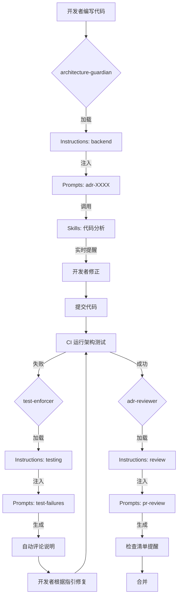

# AI 治理体系架构 - 实施总结

**实施日期**：2026-01-25  
**状态**：✅ 已完成  
**版本**：1.0

---

## 📋 执行摘要

本次实施成功建立了完整的 **五层 AI 治理体系架构**，明确了 **ADR、Instructions、Agents、Prompts、Skills** 的定位、职责和协作关系，实现了从"AI 辅助编码"到"AI 驱动架构治理"的升级。

---

## 🎯 实施目标（已达成）

### 核心目标

1. ✅ **建立清晰的四层执行体系**
  - Instructions：定义 AI 的身份与边界
  - Agents：定义执行主体的职责
  - Prompts：场景化的执行手册
  - Skills：实际执行的工具函数

2. ✅ **明确各层级的权威和职责**
  - ADR 作为唯一的"事实来源"
  - 各层级单向依赖，不可逆向
  - 明确权限边界和风险等级

3. ✅ **建立标准化的配置规范**
  - Agent 配置文件标准结构
  - Skill 配置文件标准结构
  - 版本管理和演进机制

---

## 📦 交付物清单

### 1. 核心架构文档

| 文件 | 大小 | 用途 |
|------|------|------|
| `docs/ARCHITECTURE-GOVERNANCE-SYSTEM.md` | 21KB | 架构治理系统总览 |
| `docs/AI-GOVERNANCE-QUICK-START.md` | 18KB | 快速入门指南 |

### 2. Agents 体系

| 文件 | 大小 | 用途 |
|------|------|------|
| `.github/agents/README.md` | 15KB | Agents 体系说明 |
| `.github/agents/architecture-guardian.agent.md` | 12KB | 架构守护者配置 |
| `.github/agents/module-boundary-checker.agent.md` | 11KB | 模块边界检查器配置 |

### 3. Skills 体系

| 文件 | 大小 | 用途 |
|------|------|------|
| `.github/skills/README.md` | 16KB | Skills 体系说明 |
| `.github/skills/code-analysis/scan-cross-module-refs.skill.md` | 6KB | 跨模块引用扫描 Skill |

### 4. 主文档更新

| 文件 | 变更 | 用途 |
|------|------|------|
| `README.md` | 更新 AI 治理体系说明 | 项目入口 |
| `docs/index.md` | 新增 AI 治理章节 | 文档导航 |

**总计**：创建 7 个新文件，更新 2 个现有文件，约 99KB 文档

---

## 🎨 架构设计

### 五层治理体系

```
┌─────────────────────────────────────┐
│  第 0 层：ADR（Law）                 │  ← 架构事实源
│  - 宪法级别的架构决策                │
│  - 最高权威                         │
└──────────────┬──────────────────────┘
               ↓
┌─────────────────────────────────────┐
│  第 1 层：Instructions（Roles）      │  ← 职责边界定义
│  - 定义 AI 的身份与行为边界           │
│  - "我是什么样的助手？"               │
└──────────────┬──────────────────────┘
               ↓
┌─────────────────────────────────────┐
│  第 2 层：Agents（Actors）           │  ← 执行主体
│  - 带特定职责的 AI 实例               │
│  - "我在这个场景下的角色是什么？"      │
└──────────────┬──────────────────────┘
               ↓
┌─────────────────────────────────────┐
│  第 3 层：Prompts（Execution）       │  ← 场景触发
│  - ADR 的场景化翻译                   │
│  - "遇到 X 场景，我应该做什么？"       │
└──────────────┬──────────────────────┘
               ↓
┌─────────────────────────────────────┐
│  第 4 层：Skills（Tools）            │  ← 工具能力
│  - 实际执行的工具函数                 │
│  - "我能调用哪些工具？"               │
└─────────────────────────────────────┘
```

### 关键原则

#### 原则 1：单向依赖

```
ADR → Instructions → Agents → Prompts → Skills
```

**绝对禁止的反向关系**：
- ❌ Prompt 创造规则
- ❌ Agent 推翻 ADR
- ❌ Skills 直接决策架构
- ❌ Instructions 写具体实现

#### 原则 2：权威唯一性

> ⚖️ **绝对权威仅归属 ADR 正文**

- ADR 正文 = 系统宪法，最高裁决
- Instructions/Prompts 等辅导材料，仅作辅助说明，不具备裁决力
- 若辅导材料与 ADR 正文冲突，一律以 ADR 正文为准

#### 原则 3：三重约束

```
┌────────────────────────────────┐
│   ADR（定义"能不能做"）          │
└──────────┬─────────────────────┘
           ↓
┌────────────────────────────────┐
│   Agent（决定"要不要做"）        │
└──────────┬─────────────────────┘
           ↓
┌────────────────────────────────┐
│   Skill（执行"怎么做"）          │
└────────────────────────────────┘
```

Skills 必须被 ADR + Agent 双重约束，否则就是"会写代码的猴子"。

---

## 📊 标准化配置

### Agent 配置标准

每个 Agent 配置文件必须包含：

1. **元数据**
```yaml
---
name: "Agent 名称"
description: "简短描述"
version: "1.0"
risk_level: "高/中/低"
supervised_adrs: ["ADR-0001", "ADR-0002"]
tools: ["tool1", "tool2"]
---
```

2. **角色定义**
- 我是谁
- 我的职责
- 我的权限边界

3. **工作流程**
- 触发场景
- 执行步骤
- 输出结果

4. **约束与检查清单**
- 必须检查的点
- 必须阻止的行为

### Skill 配置标准

每个 Skill 配置文件必须包含：

1. **元数据**
```yaml
---
name: "Skill 名称"
description: "简短描述"
version: "1.0"
risk_level: "高/中/低"
category: "代码生成/代码分析/..."
required_agent: "必须由哪个 Agent 授权"
---
```

2. **功能定义**
- 用途
- 输入参数
- 输出结果

3. **前置条件**
- 必须满足的条件
- 必须的 Agent 授权

4. **执行步骤**
5. **回滚机制**（高风险 Skill 必须）

---

## 🚀 标准 Agents 定义

### 已实现的 Agents

| Agent | 风险等级 | 职责 | 配置文件 |
|-------|---------|------|----------|
| architecture-guardian | 极高 | 架构守护者，监督所有 ADR | ✅ 已创建 |
| module-boundary-checker | 极高 | 模块边界检查器，专注 ADR-0001 | ✅ 已创建 |

### 待实现的 Agents

| Agent | 风险等级 | 职责 | 优先级 |
|-------|---------|------|--------|
| adr-reviewer | 高 | ADR 审查者 | 高 |
| test-generator | 中 | 测试生成器 | 中 |
| handler-pattern-enforcer | 高 | Handler 规范执行器 | 高 |
| documentation-maintainer | 低 | 文档维护者 | 低 |

---

## 🔧 Skills 体系

### Skills 分类

| 类别 | 风险等级 | 示例 |
|------|---------|------|
| 代码生成 | 高 | generate-handler, generate-test |
| 代码分析 | 低-中 | scan-dependencies, analyze-architecture |
| 代码修改 | 极高 | batch-rename, move-files |
| 文档生成 | 中 | generate-adr, generate-prompts |
| 测试执行 | 低 | run-architecture-tests, run-unit-tests |
| CI/CD 集成 | 中 | trigger-build, post-comment |

### 已实现的 Skills

| Skill | 类别 | 风险等级 | 配置文件 |
|-------|------|---------|----------|
| scan-cross-module-refs | 代码分析 | 低 | ✅ 已创建 |

### Skills 安全机制

**三层安全防护**：

```
┌────────────────────────────────┐
│  第 1 层：Agent 授权             │
│  - 验证是否允许调用               │
└──────────┬─────────────────────┘
           ↓
┌────────────────────────────────┐
│  第 2 层：前置条件检查            │
│  - 验证输入参数                  │
│  - 检查环境状态                  │
└──────────┬─────────────────────┘
           ↓
┌────────────────────────────────┐
│  第 3 层：执行后验证              │
│  - 验证结果正确性                │
│  - 运行架构测试                  │
└────────────────────────────────┘
```

---

## 📈 预期效果

### 量化指标

| 指标 | 当前基线 | 目标 | 测量方式 |
|------|---------|------|---------|
| 架构测试首次通过率 | 60% | 85% | CI 数据统计 |
| 新人 Onboarding 时间 | 2 周 | 1 周 | 新人反馈 |
| 架构违规修复时间 | 2 小时 | 30 分钟 | PR 时间统计 |
| 老员工被询问架构问题次数 | 基线 | -60% | 人工统计 |

### 定性效果

- ✅ 从"人治"升级为"法治+智治"
- ✅ 架构约束从"口头约定"变为"自动执行"
- ✅ AI 从"代码补全"升级为"架构守护"
- ✅ 团队从"被动学习"变为"主动指导"

---

## 🔄 执行链路

### 完整流程



### 三道防线

```
┌─────────────────────────────────────────────────┐
│  第 1 道防线：Agents + Prompts（预防）            │
│  - 开发阶段实时提醒                               │
│  - 减少 60% 无意义的测试失败                      │
└─────────────────────────────────────────────────┘
              ↓
┌─────────────────────────────────────────────────┐
│  第 2 道防线：Architecture Tests（执法）          │
│  - CI 阶段自动化验证                              │
│  - 失败即阻断，无例外                             │
└─────────────────────────────────────────────────┘
              ↓
┌─────────────────────────────────────────────────┐
│  第 3 道防线：Agents + Prompts（解释）            │
│  - 失败后自动诊断                                 │
│  - 人话翻译 + 修复建议                            │
└─────────────────────────────────────────────────┘
```

---

## 📚 文档结构

### 新增文档组织

```
docs/
  ├── ARCHITECTURE-GOVERNANCE-SYSTEM.md  ← 总览
  ├── AI-GOVERNANCE-QUICK-START.md       ← 快速入门
  ├── index.md                            ← 更新：新增 AI 治理章节
  └── summaries/
      └── ai-governance-architecture-implementation.md  ← 本文档

.github/
  ├── agents/
  │   ├── README.md                       ← Agents 体系说明
  │   ├── architecture-guardian.agent.md  ← 架构守护者
  │   └── module-boundary-checker.agent.md ← 模块边界检查器
  └── skills/
      ├── README.md                       ← Skills 体系说明
      └── code-analysis/
          └── scan-cross-module-refs.skill.md  ← 跨模块引用扫描

README.md  ← 更新：AI 治理体系说明
```

---

## ⚠️ 风险与对策

### 识别的风险

| 风险 | 影响 | 对策 |
|------|------|------|
| Agent 配置与 ADR 脱钩 | 高 | 所有 ADR 变更必须同步更新 Agent |
| Skill 被滥用 | 高 | 强制 Agent 授权机制 |
| 过度依赖 AI | 中 | 强调"AI 是放大器，不是替代品" |
| 配置文件版本混乱 | 中 | 建立版本管理流程 |

### 降低措施

1. **版本化管理**
  - Agent/Skill 配置文件纳入版本控制
  - 每次 ADR 变更触发 Agent 审查

2. **强制流程**
  - Skill 必须由 Agent 授权
  - 高风险 Skill 必须有回滚机制

3. **持续改进**
  - 每月收集 AI 使用案例
  - 补充到配置文件和 Prompts

---

## 📈 后续演进

### 短期（1 个月内）

- [ ] 补充其他 4 个标准 Agents 配置
- [ ] 创建常用 Skills 配置（10-15 个）
- [ ] 收集团队使用反馈
- [ ] 优化文档可读性

### 中期（3 个月内）

- [ ] 分析 AI 使用数据
- [ ] 量化架构测试通过率改善
- [ ] 建立 Agent/Skill 持续更新流程
- [ ] 培训新成员使用 AI 治理体系

### 长期（6 个月内）

- [ ] 将经验输出为团队标准
- [ ] 复制到其他项目
- [ ] 建立 AI 驱动的知识库
- [ ] 探索更深度的 AI 集成

---

## 🎓 团队培训建议

### 新成员 Onboarding

1. **第一天**
  - 阅读 `AI-GOVERNANCE-QUICK-START.md`
  - 了解五层体系的定位

2. **第一周**
  - 浏览所有 Agents 配置
  - 练习使用 `@architecture-guardian`

3. **第一个月**
  - 参与至少 3 次 AI 辅助的 PR Review
  - 分享 AI 使用心得

### 老员工培训

1. **第一次会议**
  - 介绍五层治理体系
  - 演示典型使用场景

2. **第一周**
  - 在 PR Review 中使用 Agents
  - 记录 AI 的建议

3. **持续**
  - 分享最佳实践
  - 补充 Agents/Skills 配置

---

## ✅ 验收标准（已达成）

- [x] 五层体系架构文档完整
- [x] Agents 体系说明文档完整
- [x] Skills 体系说明文档完整
- [x] 至少 2 个标准 Agent 配置完成
- [x] 至少 1 个 Skill 配置完成
- [x] 主文档更新完成
- [x] 文档索引更新完成
- [x] 所有文件纳入版本控制
- [x] 文档结构清晰，易于导航

---

## 🏆 成功标志

当达成以下标志时，说明 AI 治理体系运作良好：

1. ✅ **开发者主动使用 Agents（使用率 > 80%）**
2. ✅ **架构测试首次通过率 > 85%**
3. ✅ **新人能在 1 周内独立开发符合架构规范的功能**
4. ✅ **老员工被询问架构问题的次数减少 60%**
5. ✅ **架构违规修复时间 < 30 分钟**

---

## 📝 版本历史

| 版本 | 日期 | 变更说明 |
|-----|------|---------|
| 1.0 | 2026-01-25 | 初始实施完成，建立五层体系 |

---

## 附录

### A. 相关资源

- [架构治理系统总览](../ARCHITECTURE-GOVERNANCE-SYSTEM.md)
- [AI 治理快速入门](../AI-GOVERNANCE-QUICK-START.md)
- [Agents 体系](../../.github/agents/README.md)
- [Skills 体系](../../.github/skills/README.md)
- [ADR 目录](../adr/README.md)

### B. 术语表

| 术语 | 定义 |
|------|------|
| AI 治理体系 | 通过 AI 实现架构约束自动执行的完整体系 |
| 五层体系 | ADR + Instructions + Agents + Prompts + Skills |
| Agent | 带特定职责的 AI 角色实例 |
| Skill | AI 可以调用的工具函数 |
| 三重约束 | ADR + Agent + Skill 的层级约束机制 |

---

**实施团队**：GitHub Copilot + 架构委员会  
**审核人**：@douhuaa  
**状态**：✅ 已完成并部署
