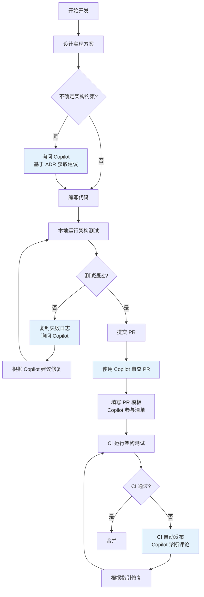

# Copilot 驱动治理体系 - 实施总结

**实施日期**：2026-01-21  
**状态**：✅ 已完成  
**版本**：1.0

---

## 📋 执行摘要

本次实施成功建立了完整的 **"Copilot 驱动"** 架构治理体系，让 GitHub Copilot 从"代码补全工具"升级为"架构守护者"
。通过固化提示词库、强制 PR 参与、自动化 CI 提示三大支柱，实现了架构规范的智能化、自动化和人性化。

---

## 🎯 实施目标（已达成）

### 核心目标

1. ✅ **固化 Copilot Prompt 为制度资产**
  - 创建版本化、可演进的提示词库
  - 每个 ADR 对应一个完整的 Prompt 文件
  - 标准化的失败解释模板

2. ✅ **强化 PR 模板的 Copilot 参与**
  - PR 必须完成 Copilot Review 清单
  - 记录 Copilot 反馈和建议处理
  - 集成到标准工作流

3. ✅ **集成 CI 失败自动提示**
  - 架构测试失败时自动输出诊断指南
  - PR 中自动发布包含详细步骤的评论
  - 测试成功时提醒完成检查清单

---

## 📦 交付物清单

### 1. Copilot 提示词库（`docs/copilot/`）

| 文件                              | 大小   | 用途                  |
|---------------------------------|------|---------------------|
| `README.md`                     | 12KB | Copilot 角色定位和使用指南   |
| `adr-0001.prompts.md`           | 13KB | ADR-0001 模块化单体与垂直切片 |
| `adr-0002.prompts.md`           | 12KB | ADR-0002 三层启动体系     |
| `adr-0003.prompts.md`           | 13KB | ADR-0003 命名空间规范     |
| `adr-0004.prompts.md`           | 13KB | ADR-0004 中央包管理      |
| `adr-0005.prompts.md`           | 17KB | ADR-0005 应用内交互模型    |
| `architecture-test-failures.md` | 11KB | 架构测试失败解释指南          |

**总计**：7 个文件，约 91KB，覆盖所有核心 ADR

### 2. PR 模板增强（`.github/PULL_REQUEST_TEMPLATE.md`）

**新增章节**：

- 🤖 Copilot 参与检查清单
- Copilot Review 记录
- Copilot 建议处理

**要求**：

- 所有 PR 必须使用 Copilot 审查
- 必须记录 Copilot 反馈
- 必须说明未采纳建议的理由

### 3. CI 工作流增强（`.github/workflows/architecture-tests.yml`）

**失败时**：

- 输出详细的 Copilot 使用指南
- 在 PR 中自动发布包含诊断步骤的评论
- 提供完整的资源链接

**成功时**：

- 显示符合的 ADR 列表
- 提醒完成 Copilot 检查清单

### 4. 主文档更新（`README.md`）

**新增章节**：

- 🤖 Copilot 驱动的架构治理
- 核心理念（三权分立模型）
- 快速开始（三个典型场景）
- 三大核心价值
- PR 要求

---

## 🎨 架构设计

### 三权分立模型

```
┌─────────────────────────────────────────────────────────┐
│               架构治理体系的三权分立                      │
├─────────────────────────────────────────────────────────┤
│  立法权      │  ADR（架构决策记录）            │  宪法  │
│  司法权      │  ArchitectureTests（测试）      │  法院  │
│  行政权      │  CI/CD Pipeline                 │  执法  │
│  ───────────────────────────────────────────────────────│
│  辅助角色    │  Copilot                         │  法务  │
│              │  - 解释宪法（ADR）              │  秘书  │
│              │  - 教人如何不违法               │  +     │
│              │  - 辅助修复违规                 │  教官  │
└─────────────────────────────────────────────────────────┘
```

**关键原则**：

- Copilot **不是** 最终裁决者
- Copilot **不能** 绕过 CI
- Copilot **不能** 替代理解 ADR
- Copilot **是** 放大理解能力的工具

---

## 📊 预期效果

### 量化指标

| 指标               | 当前基线 | 目标    | 测量方式    |
|------------------|------|-------|---------|
| 架构测试首次通过率        | 60%  | 85%   | CI 数据统计 |
| 新人 Onboarding 时间 | 2 周  | 1 周   | 新人反馈    |
| 架构违规修复时间         | 2 小时 | 30 分钟 | PR 时间统计 |
| 老员工被询问架构问题次数     | 基线   | -60%  | 人工统计    |

### 定性效果

- ✅ 预防架构违规，而非事后修复
- ✅ 降低学习曲线，加速新人上手
- ✅ 减少重复性问答，释放高级人员时间
- ✅ 统一架构理解，避免认知分叉

---

## 🚀 使用流程

### 开发者工作流



### 三个典型场景

#### 场景 1：开发新功能前

```
询问 Copilot：
"我想在 Orders 模块中添加一个新的用例，有哪些架构约束？"

Copilot 会参考：
- docs/copilot/adr-0001.prompts.md
- docs/copilot/adr-0005.prompts.md
```

#### 场景 2：架构测试失败

```
询问 Copilot：
"请根据以下架构测试失败日志，解释违规原因并提供修复建议

[粘贴失败日志]
"

Copilot 会参考：
- docs/copilot/architecture-test-failures.md
- 对应的 adr-XXXX.prompts.md
```

#### 场景 3：提交 PR 前

```
询问 Copilot：
"请基于 ADR-0001 至 ADR-0005 审查本 PR 的变更，检查是否存在架构违规。"

Copilot 会参考：
- 所有 adr-XXXX.prompts.md
- PR 中的代码变更
```

---

## 📚 文档结构

```
docs/
  copilot/                              ← Copilot 提示词库
    README.md                           ← 角色定位和使用指南
    adr-0001.prompts.md                 ← ADR-0001 提示词
    adr-0002.prompts.md                 ← ADR-0002 提示词
    adr-0003.prompts.md                 ← ADR-0003 提示词
    adr-0004.prompts.md                 ← ADR-0004 提示词
    adr-0005.prompts.md                 ← ADR-0005 提示词
    architecture-test-failures.md       ← 失败解释指南
  adr/                                  ← 架构决策记录
    ADR-0001-*.md
    ADR-0002-*.md
    ...
.github/
  PULL_REQUEST_TEMPLATE.md              ← 增强的 PR 模板
  workflows/
    architecture-tests.yml              ← 增强的 CI 工作流
README.md                               ← 更新的主文档
```

---

## 🔧 技术实现

### Prompt 文件标准结构

每个 `adr-XXXX.prompts.md` 包含：

1. **当我在写什么时，你应该提醒我哪些约束？**
  - 场景化的触发条件
  - 需要检查的约束点

2. **哪些写法必须阻止？**
  - 明确的反模式
  - 正确做法示例

3. **CI 失败时，你应该如何解释？**
  - 失败原因的人话翻译
  - 修复建议的具体步骤

4. **典型问答（FAQ）**
  - 常见问题和答案

5. **快速检查清单**
  - PR 前的自检项

### CI 集成机制

**失败时**：

```yaml
- name: Check architecture compliance
  if: failure()
  run: |
    # 输出详细的 Copilot 使用指南
    # 包含：诊断步骤、资源链接、验证方法

- name: Comment on PR with Copilot guidance
  if: failure() && github.event_name == 'pull_request'
  uses: actions/github-script@v7
  with:
    script: |
      # 在 PR 中发布包含完整诊断步骤的评论
```

---

## ⚠️ 风险与对策

### 识别的风险

| 风险              | 影响 | 对策                     |
|-----------------|----|------------------------|
| Prompt 与 ADR 脱钩 | 高  | 所有 ADR 变更必须同步更新 Prompt |
| Copilot 建议被无视   | 中  | PR 模板强制记录和处理           |
| 团队认知不统一         | 中  | 定期培训和复盘                |
| Copilot 给出错误建议  | 低  | 明确"ADR 优先级最高"          |

### 降低措施

1. **版本化管理**
  - Prompt 文件纳入版本控制
  - 每次 ADR 变更触发 Prompt 审查

2. **强制流程**
  - PR 模板要求 Copilot 参与
  - CI 失败自动提供指引

3. **持续改进**
  - 每月收集 Copilot 使用案例
  - 补充到 Prompt 库

---

## 📈 后续演进

### 短期（1-3 个月）

- [ ] 收集团队使用反馈
- [ ] 补充典型问答到 Prompt 库
- [ ] 优化 CI 评论的可读性
- [ ] 建立 Copilot 最佳实践分享机制

### 中期（3-6 个月）

- [ ] 分析 Copilot 使用数据
- [ ] 量化架构测试通过率改善
- [ ] 建立 Prompt 库的持续更新流程
- [ ] 培训新成员使用 Copilot

### 长期（6-12 个月）

- [ ] 将经验输出为团队标准
- [ ] 复制到其他项目
- [ ] 建立 Copilot 驱动的知识库
- [ ] 探索更深度的 AI 集成

---

## 🎓 团队培训建议

### 新成员 Onboarding

1. **第一天**
  - 阅读 `docs/copilot/README.md`
  - 了解 Copilot 的角色定位

2. **第一周**
  - 浏览所有 `adr-XXXX.prompts.md`
  - 练习使用 Copilot 询问架构约束

3. **第一个月**
  - 参与至少 3 次 Copilot 辅助的 PR Review
  - 分享 Copilot 使用心得

### 老员工培训

1. **第一次会议**
  - 介绍 Copilot 驱动理念
  - 演示典型使用场景

2. **第一周**
  - 在 PR Review 中使用 Copilot
  - 记录 Copilot 的建议

3. **持续**
  - 分享最佳实践
  - 补充 Prompt 库

---

## 📞 联系与支持

### 问题反馈

- **Prompt 错误或不准确**：在对应的 Prompt 文件中创建 Issue
- **CI 评论问题**：在 `.github/workflows/architecture-tests.yml` 中创建 Issue
- **使用问题**：在团队讨论频道提问

### 贡献指南

欢迎团队成员补充和改进 Prompt 库：

1. Fork 仓库
2. 在对应的 `adr-XXXX.prompts.md` 中补充案例
3. 提交 PR，标题：`docs(copilot): 补充 ADR-XXXX 的 YYY 场景`
4. 经过 Review 后合并

---

## ✅ 验收标准（已达成）

- [x] 所有 ADR 都有对应的 Prompt 文件
- [x] PR 模板包含 Copilot 参与清单
- [x] CI 失败时自动提供 Copilot 指引
- [x] CI 成功时提醒完成检查清单
- [x] PR 失败时自动发布诊断评论
- [x] 主文档包含 Copilot 使用说明
- [x] 所有文件纳入版本控制
- [x] 文档结构清晰，易于导航

---

## 🏆 成功标志

当达成以下标志时，说明 Copilot 驱动体系运作良好：

1. ✅ **架构测试首次通过率 > 85%**
2. ✅ **新人能在 1 周内独立开发符合架构规范的功能**
3. ✅ **老员工被询问架构问题的次数减少 60%**
4. ✅ **PR Review 中 Copilot 参与率 = 100%**
5. ✅ **架构违规修复时间 < 30 分钟**

---

## 📝 版本历史

| 版本  | 日期         | 变更说明   |
|-----|------------|--------|
| 1.0 | 2026-01-21 | 初始实施完成 |

---

## 附录

### A. 相关资源

- [Copilot 治理体系总览](../copilot/README.md)
- [ADR 目录](../adr/)
- [架构指南](../guides/architecture-design-guide.md)
- [CI/CD 指南](../guides/ci-cd-integration-guide.md)

### B. 术语表

| 术语         | 定义                    |
|------------|-----------------------|
| Copilot 驱动 | 让 Copilot 参与架构治理的开发模式 |
| Prompt 库   | 版本化的 Copilot 提示词集合    |
| 三权分立       | ADR、测试、CI 的职责分离模型     |
| 架构守护者      | Copilot 在本项目中的角色定位    |

---

**实施团队**：GitHub Copilot + 架构团队  
**审核人**：@douhuaa  
**状态**：✅ 已完成并部署
