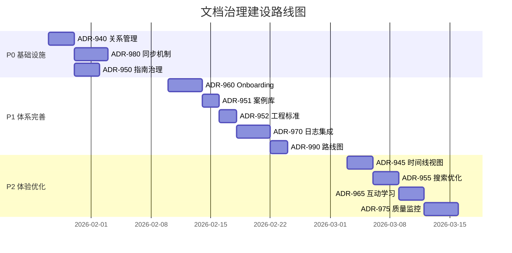

# 文档治理体系空白分析总结

**文档类型**：改进总结  
**创建日期**：2026-01-26  
**状态**：✅ 已完成  
**相关 ADR**：ADR-008, ADR-900, ADR-910, ADR-920

---

## 📋 总结概览

本文档是对 [ADR 文档治理体系空白分析详细报告](../adr/proposals/ADR-Documentation-Governance-Gap-Analysis.md) 的高层总结，便于快速理解当前文档治理的缺失领域和建设建议。

---

## 🎯 核心发现

### 现有治理机制（已完善）✅

当前项目已建立以下文档治理机制：

| 治理机制 | ADR 编号 | 覆盖范围 |
|---------|---------|---------|
| ADR 正文治理 | ADR-008, 0900 | 文档分级、权限边界、变更流程 |
| README 治理 | ADR-910 | 禁用裁决性语言、强制声明 |
| 示例代码治理 | ADR-920 | 分级执法、免责声明、责任人制度 |
| 代码审查合规 | ADR-930 | PR 审查流程 |

**优势**：
- 🎯 ADR 作为唯一裁决源的原则已确立
- 🎯 README 和示例代码的越界行为得到有效控制
- 🎯 文档分级体系清晰（宪法级→治理级→执行级→说明级）

---

### 治理缺失领域（待建设）❌

识别出 **5 个关键空白领域**：

#### 1. ADR 关系与溯源管理 🔴 P0

**问题**：
- ADR 之间的依赖、替代、引用关系未标准化
- 缺少全局演进视图，难以追溯变更历史
- 破坏性变更的影响面分析缺少系统化方法

**影响**：
- 开发者不清楚 ADR 之间的关联性
- ADR 修订时可能遗漏需要同步更新的关联 ADR
- 新人难以理解架构演进过程

**建议方案**：ADR-940（ADR 关系与溯源管理治理规范）

---

#### 2. 非裁决性文档治理标准 🟡 P1

**问题**：
- 指南（Guide）、FAQ、案例文档缺少统一治理标准
- 与 ADR 的分离边界不明确（何时写 ADR vs 何时写 Guide？）
- 工程标准（Engineering Standards）与 ADR 的关系模糊
- 缺少架构演进路线图

**影响**：
- 团队成员不确定应该将内容写在哪里
- 可能出现 Guide 越界定义架构规则的情况
- 常见问题散落各处，查找困难
- 实践经验未系统化沉淀

**建议方案**：
- ADR-950（指南与 FAQ 文档治理规范）
- ADR-951（案例库管理规范）
- ADR-952（工程标准与 ADR 分离边界）
- ADR-990（文档演进路线图管理规范）

---

#### 3. Onboarding 文档专项治理 🟡 P1

**问题**：
- QUICK-START.md 缺少定期审计机制
- Onboarding 文档结构未标准化
- 职责分离不明确（谁负责维护？多久更新？）
- 新人反馈机制缺失

**影响**：
- Onboarding 文档可能与实际代码脱节
- 新人遇到障碍但无人察觉
- 无法持续改进新人入职体验

**建议方案**：ADR-960（Onboarding 文档治理规范）

---

#### 4. 自动化工具日志集成与分发 🟢 P2

**问题**：
- 架构测试报告、CI 日志、工具输出缺少统一管理
- 自动生成的变更记录（如依赖更新）缺少分发标准
- 日志与文档的关联机制缺失

**影响**：
- 开发者需要主动去 CI 查看测试失败原因，效率低
- 难以追溯"谁/什么时候/为什么"进行了变更
- 测试失败时需要手动查找相关 ADR

**建议方案**：ADR-970（自动化工具日志与变更记录集成标准）

---

#### 5. ADR 生命周期一体化变更同步 🔴 P0

**问题**：
- ADR-900 要求"三位一体交付"（ADR + 测试 + Prompt），但缺少强制同步机制
- ADR 变更时，Prompt 和测试可能漏更新
- 缺少自动化检测工具验证同步性

**影响**：
- ADR、测试、Prompt 可能出现版本不一致
- 依赖人工检查，容易遗漏
- Copilot 可能学习到过时的 Prompt

**建议方案**：ADR-980（ADR 生命周期一体化同步机制）

---

## 🚀 建设建议汇总

提出 **12 项具体建设建议**，按优先级分为 3 级：

### 🔴 P0：紧急（必须尽快实施）

| 编号 | 名称 | 关键价值 | 工时 |
|------|------|---------|------|
| ADR-940 | ADR 关系与溯源管理治理规范 | 标准化 ADR 关系，提供全局演进视图 | 2-3天 |
| ADR-980 | ADR 生命周期一体化同步机制 | 强制 ADR/测试/Prompt 同步，防止版本不一致 | 3-4天 |
| ADR-950 | 指南与 FAQ 文档治理规范 | 明确非裁决性文档边界，防止越界 | 2-3天 |

**P0 总工时**：7-10 天

---

### 🟡 P1：重要（Q1 完成）

| 编号 | 名称 | 关键价值 | 工时 |
|------|------|---------|------|
| ADR-960 | Onboarding 文档治理规范 | 系统化新人入职体验，降低学习成本 | 3-4天 |
| ADR-951 | 案例库管理规范 | 沉淀实践经验，加速知识传播 | 1-2天 |
| ADR-952 | 工程标准与 ADR 分离边界 | 明确工程标准定位，防止与 ADR 混淆 | 1-2天 |
| ADR-970 | 自动化工具日志集成标准 | 统一日志管理，提高问题排查效率 | 3-4天 |
| ADR-990 | 文档演进路线图管理规范 | 系统化路线图，保持团队方向一致 | 1-2天 |

**P1 总工时**：9-14 天

---

### 🟢 P2：增强（Q2-Q3）

| 编号 | 名称 | 关键价值 | 工时 |
|------|------|---------|------|
| ADR-945 | ADR 全局时间线与演进视图 | 提供演进全局视图，辅助决策 | 2-3天 |
| ADR-955 | 文档搜索与可发现性优化 | 提升查找效率，改善用户体验 | 2-3天 |
| ADR-965 | Onboarding 互动式学习路径 | 提供交互式体验，增强学习效果 | 2-3天 |
| ADR-975 | 文档质量指标与监控 | 量化文档质量，持续改进 | 3-4天 |

**P2 总工时**：9-13 天

---

### 总工时估算

| 阶段 | 优先级 | ADR 数量 | 预计工时 |
|------|--------|----------|----------|
| 阶段 1 | 🔴 P0 | 3 | 10-12 天 |
| 阶段 2 | 🟡 P1 | 5 | 14-16 天 |
| 阶段 3 | 🟢 P2 | 4 | 13-15 天 |
| **总计** | | **12** | **37-43 天（8 周）** |

---

## 📊 实施路线图

### 三阶段实施策略



### 阶段交付物

#### 阶段 1（Week 1-2）：基础设施

**目标**：解决最紧迫的同步和关系管理问题

**交付物**：
- ✅ ADR-940 + 关系图生成工具
- ✅ ADR-980 + 版本同步检测测试
- ✅ ADR-950 + 至少 2 个 Guide 和 1 个 FAQ

**成功标准**：
- 所有现有 ADR 都包含关系声明章节
- ADR/测试/Prompt 版本号同步检测通过
- 至少创建 2 个 Guide 文档和 1 个 FAQ 文档

---

#### 阶段 2（Week 3-5）：体系完善

**目标**：建立完整的非裁决性文档治理体系

**交付物**：
- ✅ ADR-960 + Onboarding 互动清单模板
- ✅ ADR-951 + 至少 5 个案例
- ✅ ADR-952 + 工程标准模板
- ✅ ADR-970 + 日志结构化标准
- ✅ ADR-990 + 首版架构演进路线图

**成功标准**：
- Onboarding 文档完成首次审计和更新
- 案例库包含至少 5 个案例
- 日志集成标准应用于至少 1 个自动化工具

---

#### 阶段 3（Week 6-8）：体验优化

**目标**：提升文档可用性和用户体验

**交付物**：
- ✅ ADR-945 + 演进时间线自动生成工具
- ✅ ADR-955 + 关键词索引
- ✅ ADR-965 + 新人 Onboarding Issue Template
- ✅ ADR-975 + 质量监控仪表盘

**成功标准**：
- ADR 演进时间线自动生成
- 文档搜索时间平均 <2 分钟
- 文档质量指标监控上线

---

## ⚠️ 风险与缓解

### 主要风险

| 风险 | 概率 | 影响 | 缓解措施 |
|------|------|------|----------|
| 团队资源不足 | 中 | 高 | 分阶段实施，P0 优先，可延后 P2 |
| 现有 ADR 需要修订 | 高 | 中 | 在实施过程中同步修订，不影响主线 |
| 工具开发复杂度超预期 | 中 | 中 | 优先手动流程，工具逐步自动化 |
| 团队习惯改变阻力 | 低 | 中 | 提供充分培训和文档支持 |

### 关键依赖关系

```
ADR-008（文档治理） → ADR-940（关系管理）
                      → ADR-950（指南治理）
                      → ADR-975（质量监控）

ADR-900（ADR 流程） → ADR-980（同步机制）

ADR-940 → ADR-945（时间线视图）
       → ADR-955（搜索优化）

ADR-950 → ADR-960（Onboarding）
       → ADR-951（案例库）
       → ADR-952（工程标准）

ADR-960 → ADR-965（互动学习）

ADR-900（测试治理） → ADR-970（日志集成）
```

---

## 💡 关键洞察

### 1. 文档治理的本质

> **文档不是"知识沉淀工具"，而是治理体系的一部分。**

- 当前已完善的治理机制侧重于"防御"（防止文档越界）
- 缺失的治理机制侧重于"连接"（ADR 关系）和"效率"（同步、搜索）

### 2. 三位一体的挑战

> **ADR + 测试 + Prompt 的三位一体是理想，但缺少执法机制。**

- ADR-900 已要求三位一体交付
- 但缺少自动化检测工具验证同步性
- 依赖人工检查，容易遗漏

### 3. 非裁决性文档的尴尬

> **Guide、FAQ、Case 的定位模糊，容易与 ADR 混淆。**

- 开发者不确定何时写 ADR vs 何时写 Guide
- 工程标准（Engineering Standards）与 ADR 的关系不清
- 需要明确的分离边界规则

### 4. Onboarding 的隐形成本

> **新人入职体验直接影响团队生产力，但缺少系统化管理。**

- QUICK-START.md 存在但缺少定期审计
- 无新人反馈机制，痛点无法持续改进
- 缺少明确的"Onboarding 完成"标准

---

## 🎯 下一步行动建议

### 立即启动（本周）

1. **召开架构委员会会议**
   - 审议本分析报告
   - 确认 P0 项目优先级
   - 分配责任人

2. **启动 ADR-940（ADR 关系管理）**
   - 定义关系声明标准格式
   - 为现有 ADR 补充关系声明
   - 开发关系图生成工具

3. **启动 ADR-980（同步机制）**
   - 定义版本号关联规则
   - 开发 CI 同步检测测试
   - 更新 CODEOWNERS

### Q1 完成（2026年3月底前）

- ✅ 完成所有 P0 和 P1 项目
- ✅ 至少创建 5 个案例文档
- ✅ Onboarding 文档完成首次审计

### Q2-Q3 考虑（2026年4-9月）

- 根据 Q1 实施效果评估 P2 项目优先级
- 可能调整部分 P2 项目的优先级

---

## 📚 相关资源

- **详细报告**：[ADR 文档治理体系空白分析](../adr/proposals/ADR-Documentation-Governance-Gap-Analysis.md)
- **现有治理**：
  - [ADR-008：文档编写与维护宪法](../adr/constitutional/ADR-008-documentation-governance-constitution.md)
  - [ADR-900：ADR 新增与修订流程](../adr/governance/ADR-900-architecture-tests.md)
  - [ADR-910：README 编写与维护治理规范](../adr/governance/ADR-910-readme-governance-constitution.md)
  - [ADR-920：示例代码治理规范](../adr/governance/ADR-920-examples-governance-constitution.md)

---

## 📝 变更历史

| 版本 | 日期 | 变更说明 | 作者 |
|------|------|----------|------|
| 1.0 | 2026-01-26 | 初版：汇总空白分析，提供高层概览 | GitHub Copilot |

---

**维护**：架构委员会  
**审核**：待定  
**状态**：✅ 已完成
